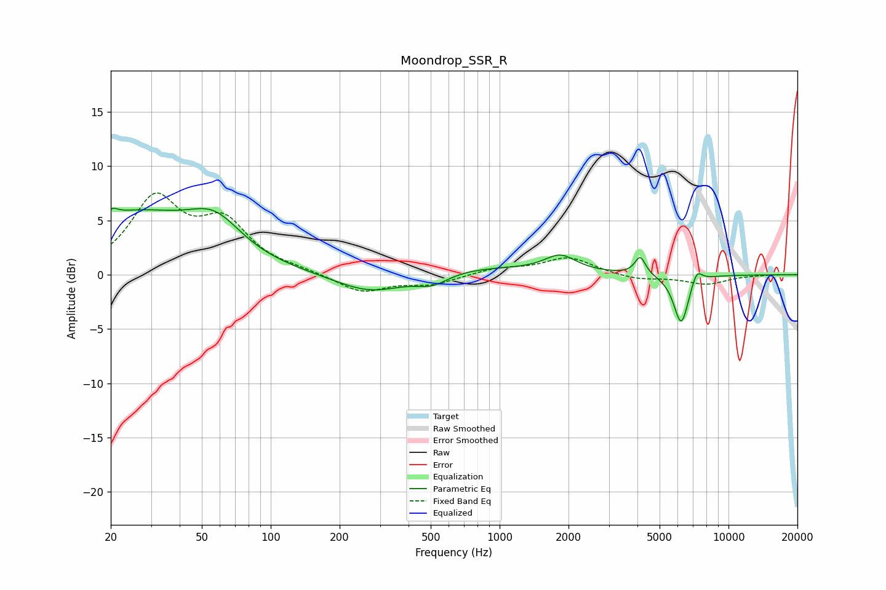

# Moondrop_SSR_R
See [usage instructions](https://github.com/jaakkopasanen/AutoEq#usage) for more options and info.

### Parametric EQs
Apply preamp of -6.2 dB when using parametric equalizer.

|   # | Type    |   Fc (Hz) |    Q |   Gain (dB) |
|-----|---------|-----------|------|-------------|
|   1 | Peaking |        20 | 5.8  |         0.6 |
|   2 | Peaking |        25 | 0.51 |         5.4 |
|   3 | Peaking |        57 | 1.22 |         3.1 |
|   4 | Peaking |       275 | 0.9  |        -2   |
|   5 | Peaking |       507 | 1.94 |        -1.1 |
|   6 | Peaking |       671 | 0.44 |         0.8 |
|   7 | Peaking |      1844 | 2.07 |         1.5 |
|   8 | Peaking |      4113 | 6    |         1.7 |
|   9 | Peaking |      6215 | 4.18 |        -4.6 |
|  10 | Peaking |      7259 | 5.79 |         1.3 |

### Fixed Band EQs
When using fixed band (also called graphic) equalizer, apply preamp of **-7.6 dB** (if available) and set gains manually with these parameters.

|   # | Type    |   Fc (Hz) |    Q |   Gain (dB) |
|-----|---------|-----------|------|-------------|
|   1 | Peaking |        31 | 1.41 |         6.7 |
|   2 | Peaking |        62 | 1.41 |         4.4 |
|   3 | Peaking |       125 | 1.41 |         0.3 |
|   4 | Peaking |       250 | 1.41 |        -1.6 |
|   5 | Peaking |       500 | 1.41 |        -0.9 |
|   6 | Peaking |      1000 | 1.41 |         0.6 |
|   7 | Peaking |      2000 | 1.41 |         1.6 |
|   8 | Peaking |      4000 | 1.41 |        -0.5 |
|   9 | Peaking |      8000 | 1.41 |        -0.8 |
|  10 | Peaking |     16000 | 1.41 |         0   |

### Graphs

