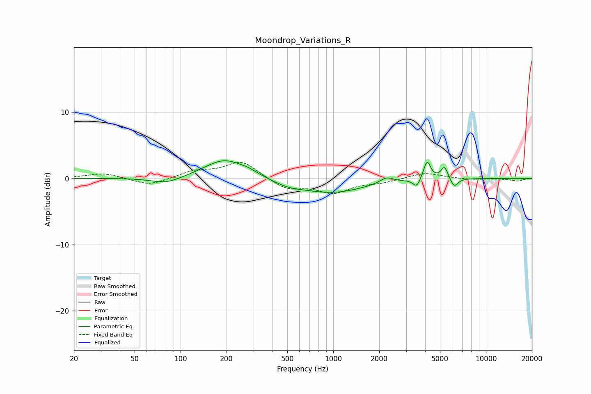

# Moondrop_Variations_R
See [usage instructions](https://github.com/jaakkopasanen/AutoEq#usage) for more options and info.

### Parametric EQs
Apply preamp of -2.8 dB when using parametric equalizer.

|   # | Type    |   Fc (Hz) |    Q |   Gain (dB) |
|-----|---------|-----------|------|-------------|
|   1 | Peaking |        81 | 1.5  |        -1   |
|   2 | Peaking |       194 | 1.08 |         2.9 |
|   3 | Peaking |       281 | 2.33 |         0.4 |
|   4 | Peaking |       505 | 1.48 |        -0.7 |
|   5 | Peaking |       978 | 0.66 |        -2.1 |
|   6 | Peaking |      2234 | 3.33 |         0.9 |
|   7 | Peaking |      3521 | 5.95 |        -1.3 |
|   8 | Peaking |      4115 | 6    |         2.8 |
|   9 | Peaking |      5354 | 6    |         1.9 |
|  10 | Peaking |      6188 | 5.53 |        -1.4 |

### Fixed Band EQs
When using fixed band (also called graphic) equalizer, apply preamp of **-2.5 dB** (if available) and set gains manually with these parameters.

|   # | Type    |   Fc (Hz) |    Q |   Gain (dB) |
|-----|---------|-----------|------|-------------|
|   1 | Peaking |        31 | 1.41 |         0.8 |
|   2 | Peaking |        62 | 1.41 |        -1.1 |
|   3 | Peaking |       125 | 1.41 |         1   |
|   4 | Peaking |       250 | 1.41 |         2.6 |
|   5 | Peaking |       500 | 1.41 |        -1.6 |
|   6 | Peaking |      1000 | 1.41 |        -2   |
|   7 | Peaking |      2000 | 1.41 |        -0.5 |
|   8 | Peaking |      4000 | 1.41 |         0.9 |
|   9 | Peaking |      8000 | 1.41 |        -0.2 |
|  10 | Peaking |     16000 | 1.41 |        -0.4 |

### Graphs

