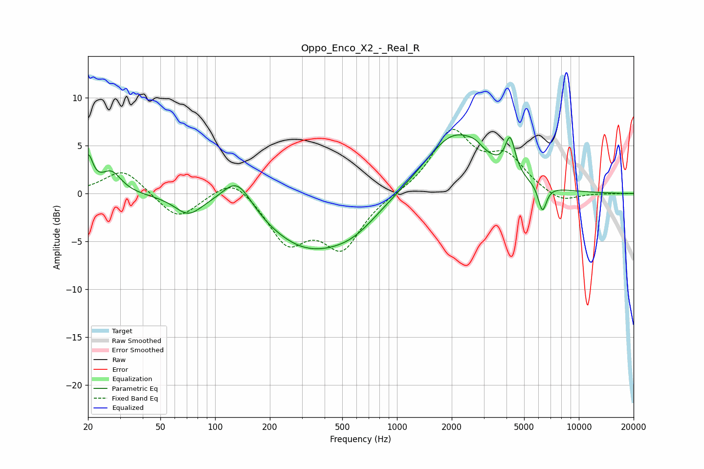

# Oppo_Enco_X2_-_Real_R
See [usage instructions](https://github.com/jaakkopasanen/AutoEq#usage) for more options and info.

### Parametric EQs
Apply preamp of -6.2 dB when using parametric equalizer.

|   # | Type    |   Fc (Hz) |    Q |   Gain (dB) |
|-----|---------|-----------|------|-------------|
|   1 | Peaking |        20 | 5.42 |         3.5 |
|   2 | Peaking |        27 | 2.59 |         2.2 |
|   3 | Peaking |        71 | 1.96 |        -1.9 |
|   4 | Peaking |       132 | 1.7  |         3.5 |
|   5 | Peaking |       320 | 0.57 |        -5.5 |
|   6 | Peaking |       580 | 1.02 |        -1.7 |
|   7 | Peaking |      2079 | 0.84 |         6.5 |
|   8 | Peaking |      2677 | 3.56 |         0.5 |
|   9 | Peaking |      4191 | 5.15 |         3.7 |
|  10 | Peaking |      6304 | 6    |        -2.8 |

### Fixed Band EQs
When using fixed band (also called graphic) equalizer, apply preamp of **-6.8 dB** (if available) and set gains manually with these parameters.

|   # | Type    |   Fc (Hz) |    Q |   Gain (dB) |
|-----|---------|-----------|------|-------------|
|   1 | Peaking |        31 | 1.41 |         2.6 |
|   2 | Peaking |        62 | 1.41 |        -2.8 |
|   3 | Peaking |       125 | 1.41 |         2.1 |
|   4 | Peaking |       250 | 1.41 |        -4.9 |
|   5 | Peaking |       500 | 1.41 |        -5.4 |
|   6 | Peaking |      1000 | 1.41 |        -0   |
|   7 | Peaking |      2000 | 1.41 |         6.4 |
|   8 | Peaking |      4000 | 1.41 |         3.4 |
|   9 | Peaking |      8000 | 1.41 |        -1.1 |
|  10 | Peaking |     16000 | 1.41 |        -0   |

### Graphs

