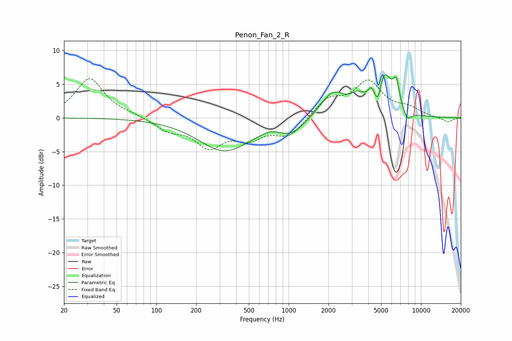

# Penon_Fan_2_R
See [usage instructions](https://github.com/jaakkopasanen/AutoEq#usage) for more options and info.

### Parametric EQs
Apply preamp of -6.5 dB when using parametric equalizer.

|   # | Type    |   Fc (Hz) |    Q |   Gain (dB) |
|-----|---------|-----------|------|-------------|
|   1 | Peaking |       327 | 0.71 |        -4.8 |
|   2 | Peaking |       728 | 2.64 |         0.4 |
|   3 | Peaking |      1059 | 1.43 |        -2   |
|   4 | Peaking |      2165 | 1.47 |         3.8 |
|   5 | Peaking |      3312 | 2.86 |         1.7 |
|   6 | Peaking |      4191 | 5.99 |         1.3 |
|   7 | Peaking |      4725 | 6    |        -2.9 |
|   8 | Peaking |      5256 | 2.26 |         6.3 |
|   9 | Peaking |      6502 | 5.89 |         3.3 |
|  10 | Peaking |      7883 | 4.1  |        -1.5 |

### Fixed Band EQs
When using fixed band (also called graphic) equalizer, apply preamp of **-5.9 dB** (if available) and set gains manually with these parameters.

|   # | Type    |   Fc (Hz) |    Q |   Gain (dB) |
|-----|---------|-----------|------|-------------|
|   1 | Peaking |        31 | 1.41 |         5.8 |
|   2 | Peaking |        62 | 1.41 |         0.4 |
|   3 | Peaking |       125 | 1.41 |        -1.7 |
|   4 | Peaking |       250 | 1.41 |        -4   |
|   5 | Peaking |       500 | 1.41 |        -2.6 |
|   6 | Peaking |      1000 | 1.41 |        -2.7 |
|   7 | Peaking |      2000 | 1.41 |         2.7 |
|   8 | Peaking |      4000 | 1.41 |         5.1 |
|   9 | Peaking |      8000 | 1.41 |         1.2 |
|  10 | Peaking |     16000 | 1.41 |        -0.7 |

### Graphs

