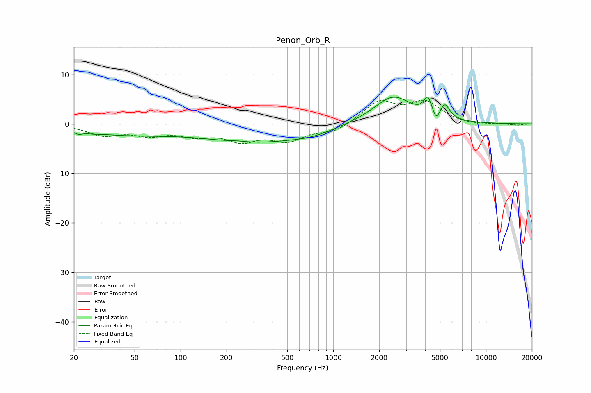

# Penon_Orb_R
See [usage instructions](https://github.com/jaakkopasanen/AutoEq#usage) for more options and info.

### Parametric EQs
Apply preamp of -5.5 dB when using parametric equalizer.

|   # | Type    |   Fc (Hz) |    Q |   Gain (dB) |
|-----|---------|-----------|------|-------------|
|   1 | Peaking |        21 | 5.69 |        -0.6 |
|   2 | Peaking |        27 | 5.06 |        -0.2 |
|   3 | Peaking |        43 | 0.42 |        -2   |
|   4 | Peaking |       235 | 2.07 |         0.3 |
|   5 | Peaking |       290 | 0.47 |        -3.4 |
|   6 | Peaking |       715 | 0.92 |        -1.3 |
|   7 | Peaking |      2468 | 1.11 |         5.6 |
|   8 | Peaking |      4161 | 5.41 |         3.4 |
|   9 | Peaking |      4737 | 6    |        -2.2 |
|  10 | Peaking |      5371 | 4.32 |         3   |

### Fixed Band EQs
When using fixed band (also called graphic) equalizer, apply preamp of **-4.9 dB** (if available) and set gains manually with these parameters.

|   # | Type    |   Fc (Hz) |    Q |   Gain (dB) |
|-----|---------|-----------|------|-------------|
|   1 | Peaking |        31 | 1.41 |        -2.1 |
|   2 | Peaking |        62 | 1.41 |        -1.9 |
|   3 | Peaking |       125 | 1.41 |        -1.9 |
|   4 | Peaking |       250 | 1.41 |        -3   |
|   5 | Peaking |       500 | 1.41 |        -3   |
|   6 | Peaking |      1000 | 1.41 |        -1.7 |
|   7 | Peaking |      2000 | 1.41 |         4.4 |
|   8 | Peaking |      4000 | 1.41 |         4.1 |
|   9 | Peaking |      8000 | 1.41 |        -0.3 |
|  10 | Peaking |     16000 | 1.41 |        -0.3 |

### Graphs

