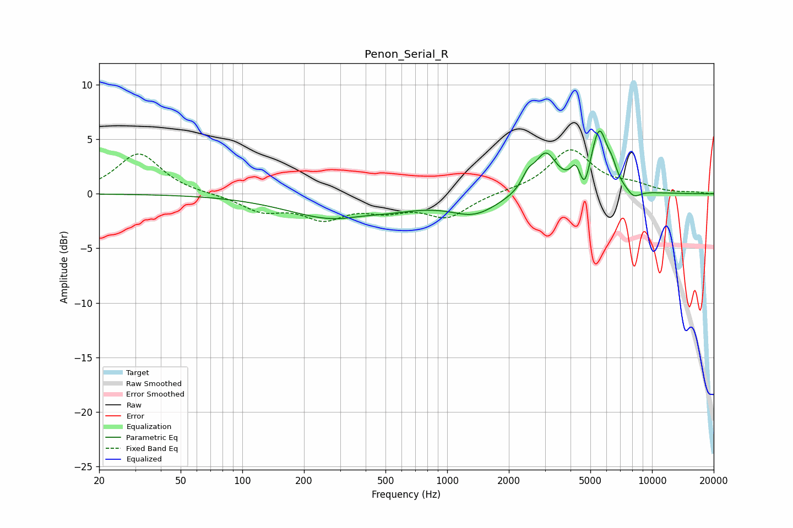

# Penon_Serial_R
See [usage instructions](https://github.com/jaakkopasanen/AutoEq#usage) for more options and info.

### Parametric EQs
Apply preamp of -5.9 dB when using parametric equalizer.

|   # | Type    |   Fc (Hz) |    Q |   Gain (dB) |
|-----|---------|-----------|------|-------------|
|   1 | Peaking |       320 | 0.57 |        -2.6 |
|   2 | Peaking |       378 | 1.31 |         0.5 |
|   3 | Peaking |      1364 | 1.22 |        -1.7 |
|   4 | Peaking |      2480 | 4.77 |         1.1 |
|   5 | Peaking |      3026 | 2.6  |         3.6 |
|   6 | Peaking |      4235 | 6    |         1.5 |
|   7 | Peaking |      4693 | 6    |        -1.9 |
|   8 | Peaking |      5525 | 3.36 |         5.7 |
|   9 | Peaking |      6383 | 6    |         1   |
|  10 | Peaking |      8128 | 3.91 |        -0.8 |

### Fixed Band EQs
When using fixed band (also called graphic) equalizer, apply preamp of **-4.1 dB** (if available) and set gains manually with these parameters.

|   # | Type    |   Fc (Hz) |    Q |   Gain (dB) |
|-----|---------|-----------|------|-------------|
|   1 | Peaking |        31 | 1.41 |         3.7 |
|   2 | Peaking |        62 | 1.41 |        -0   |
|   3 | Peaking |       125 | 1.41 |        -1.5 |
|   4 | Peaking |       250 | 1.41 |        -2   |
|   5 | Peaking |       500 | 1.41 |        -1.2 |
|   6 | Peaking |      1000 | 1.41 |        -2   |
|   7 | Peaking |      2000 | 1.41 |         0.2 |
|   8 | Peaking |      4000 | 1.41 |         4   |
|   9 | Peaking |      8000 | 1.41 |         0.7 |
|  10 | Peaking |     16000 | 1.41 |         0.1 |

### Graphs

