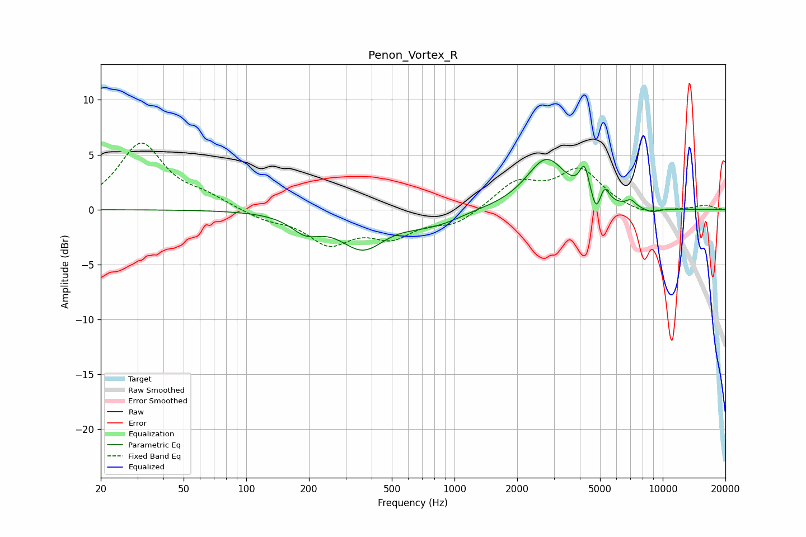

# Penon_Vortex_R
See [usage instructions](https://github.com/jaakkopasanen/AutoEq#usage) for more options and info.

### Parametric EQs
Apply preamp of -4.7 dB when using parametric equalizer.

|   # | Type    |   Fc (Hz) |    Q |   Gain (dB) |
|-----|---------|-----------|------|-------------|
|   1 | Peaking |       193 | 1.96 |        -1.5 |
|   2 | Peaking |       362 | 1.29 |        -3.3 |
|   3 | Peaking |       673 | 1.4  |        -0.6 |
|   4 | Peaking |       890 | 1.37 |        -0.7 |
|   5 | Peaking |      2764 | 1.48 |         4.6 |
|   6 | Peaking |      4214 | 5.99 |         2.6 |
|   7 | Peaking |      4792 | 6    |        -1.9 |
|   8 | Peaking |      5240 | 6    |         1.5 |
|   9 | Peaking |      7028 | 6    |         0.6 |
|  10 | Peaking |      8797 | 3.02 |        -0.4 |

### Fixed Band EQs
When using fixed band (also called graphic) equalizer, apply preamp of **-6.2 dB** (if available) and set gains manually with these parameters.

|   # | Type    |   Fc (Hz) |    Q |   Gain (dB) |
|-----|---------|-----------|------|-------------|
|   1 | Peaking |        31 | 1.41 |         5.9 |
|   2 | Peaking |        62 | 1.41 |         1   |
|   3 | Peaking |       125 | 1.41 |        -0.8 |
|   4 | Peaking |       250 | 1.41 |        -2.9 |
|   5 | Peaking |       500 | 1.41 |        -2.2 |
|   6 | Peaking |      1000 | 1.41 |        -1.3 |
|   7 | Peaking |      2000 | 1.41 |         2.4 |
|   8 | Peaking |      4000 | 1.41 |         3.5 |
|   9 | Peaking |      8000 | 1.41 |        -0.6 |
|  10 | Peaking |     16000 | 1.41 |         0.4 |

### Graphs

