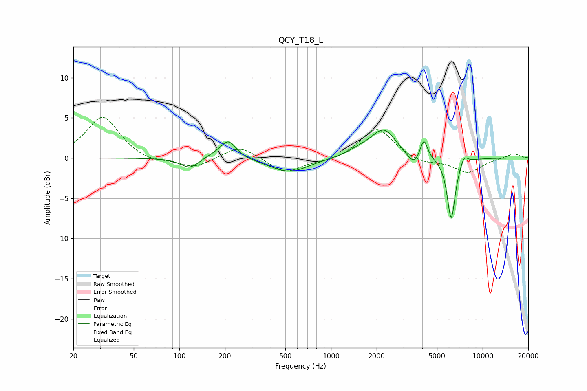

# QCY_T18_L
See [usage instructions](https://github.com/jaakkopasanen/AutoEq#usage) for more options and info.

### Parametric EQs
Apply preamp of -3.6 dB when using parametric equalizer.

|   # | Type    |   Fc (Hz) |    Q |   Gain (dB) |
|-----|---------|-----------|------|-------------|
|   1 | Peaking |       117 | 2.38 |        -1.3 |
|   2 | Peaking |       172 | 1.97 |         0.4 |
|   3 | Peaking |       211 | 2.81 |         2.2 |
|   4 | Peaking |       532 | 1.13 |        -1.8 |
|   5 | Peaking |      1575 | 1.63 |         0.7 |
|   6 | Peaking |      2232 | 1.77 |         3.4 |
|   7 | Peaking |      3502 | 3.41 |        -1.5 |
|   8 | Peaking |      4097 | 6    |         2.5 |
|   9 | Peaking |      6206 | 5.15 |        -7.7 |
|  10 | Peaking |      7558 | 6    |         1.1 |

### Fixed Band EQs
When using fixed band (also called graphic) equalizer, apply preamp of **-5.2 dB** (if available) and set gains manually with these parameters.

|   # | Type    |   Fc (Hz) |    Q |   Gain (dB) |
|-----|---------|-----------|------|-------------|
|   1 | Peaking |        31 | 1.41 |         5.2 |
|   2 | Peaking |        62 | 1.41 |        -0.6 |
|   3 | Peaking |       125 | 1.41 |        -1.3 |
|   4 | Peaking |       250 | 1.41 |         1.6 |
|   5 | Peaking |       500 | 1.41 |        -1.9 |
|   6 | Peaking |      1000 | 1.41 |        -0.5 |
|   7 | Peaking |      2000 | 1.41 |         3.8 |
|   8 | Peaking |      4000 | 1.41 |        -0.7 |
|   9 | Peaking |      8000 | 1.41 |        -1.8 |
|  10 | Peaking |     16000 | 1.41 |         0.6 |

### Graphs

