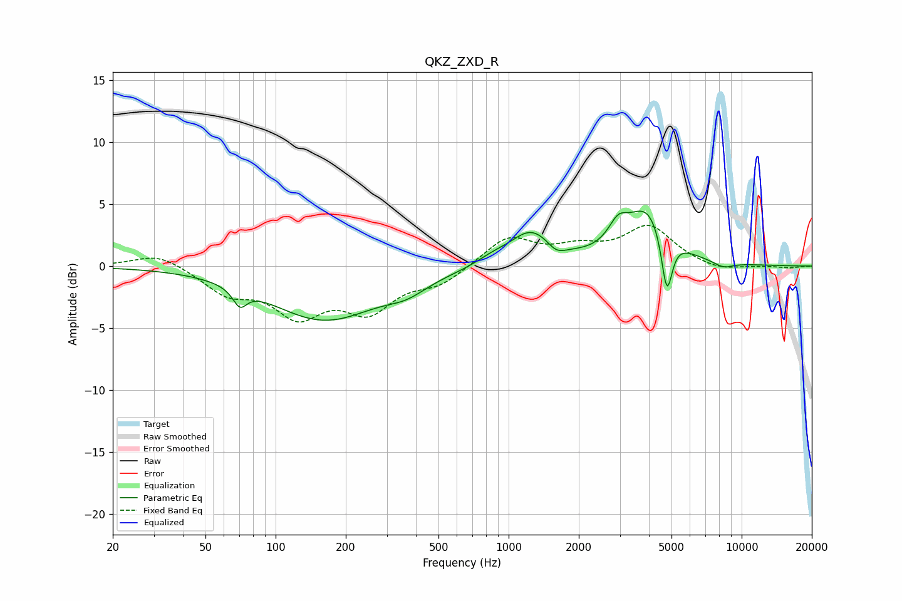

# QKZ_ZXD_R
See [usage instructions](https://github.com/jaakkopasanen/AutoEq#usage) for more options and info.

### Parametric EQs
Apply preamp of -4.5 dB when using parametric equalizer.

|   # | Type    |   Fc (Hz) |    Q |   Gain (dB) |
|-----|---------|-----------|------|-------------|
|   1 | Peaking |        70 | 4.8  |        -1.4 |
|   2 | Peaking |       162 | 0.6  |        -4.3 |
|   3 | Peaking |       366 | 1.61 |        -0.9 |
|   4 | Peaking |       847 | 2.11 |         0.5 |
|   5 | Peaking |      1248 | 1.52 |         2.7 |
|   6 | Peaking |      1603 | 3.62 |        -0.8 |
|   7 | Peaking |      2947 | 3.46 |         1.6 |
|   8 | Peaking |      3939 | 1.5  |         4.5 |
|   9 | Peaking |      4776 | 6    |        -5   |
|  10 | Peaking |      8333 | 2.97 |        -0.5 |

### Fixed Band EQs
When using fixed band (also called graphic) equalizer, apply preamp of **-3.4 dB** (if available) and set gains manually with these parameters.

|   # | Type    |   Fc (Hz) |    Q |   Gain (dB) |
|-----|---------|-----------|------|-------------|
|   1 | Peaking |        31 | 1.41 |         1.1 |
|   2 | Peaking |        62 | 1.41 |        -2   |
|   3 | Peaking |       125 | 1.41 |        -3.6 |
|   4 | Peaking |       250 | 1.41 |        -3.2 |
|   5 | Peaking |       500 | 1.41 |        -1.3 |
|   6 | Peaking |      1000 | 1.41 |         2.3 |
|   7 | Peaking |      2000 | 1.41 |         1.2 |
|   8 | Peaking |      4000 | 1.41 |         3.1 |
|   9 | Peaking |      8000 | 1.41 |        -0.5 |
|  10 | Peaking |     16000 | 1.41 |        -0.1 |

### Graphs

