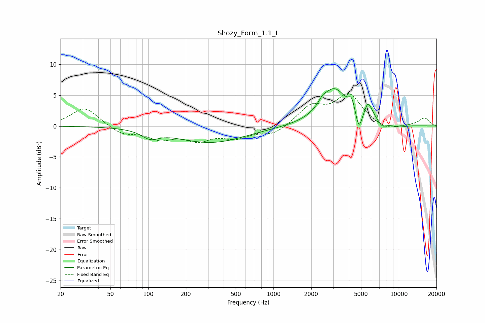

# Shozy_Form_1.1_L
See [usage instructions](https://github.com/jaakkopasanen/AutoEq#usage) for more options and info.

### Parametric EQs
Apply preamp of -6.1 dB when using parametric equalizer.

|   # | Type    |   Fc (Hz) |    Q |   Gain (dB) |
|-----|---------|-----------|------|-------------|
|   1 | Peaking |       104 | 2.16 |        -1.3 |
|   2 | Peaking |       315 | 0.51 |        -2.7 |
|   3 | Peaking |      2459 | 4.83 |         0.7 |
|   4 | Peaking |      3048 | 1.33 |         5.9 |
|   5 | Peaking |      4200 | 6    |         1.8 |
|   6 | Peaking |      4804 | 6    |        -2.9 |
|   7 | Peaking |      5656 | 5.64 |         1.9 |
|   8 | Peaking |      6063 | 3.56 |         1.1 |
|   9 | Peaking |      7384 | 3.93 |        -0.8 |
|  10 | Peaking |     10000 | 2.12 |        -0.4 |

### Fixed Band EQs
When using fixed band (also called graphic) equalizer, apply preamp of **-5.4 dB** (if available) and set gains manually with these parameters.

|   # | Type    |   Fc (Hz) |    Q |   Gain (dB) |
|-----|---------|-----------|------|-------------|
|   1 | Peaking |        31 | 1.41 |         3.1 |
|   2 | Peaking |        62 | 1.41 |        -1.3 |
|   3 | Peaking |       125 | 1.41 |        -1.8 |
|   4 | Peaking |       250 | 1.41 |        -2   |
|   5 | Peaking |       500 | 1.41 |        -1.7 |
|   6 | Peaking |      1000 | 1.41 |        -1.4 |
|   7 | Peaking |      2000 | 1.41 |         3   |
|   8 | Peaking |      4000 | 1.41 |         4.9 |
|   9 | Peaking |      8000 | 1.41 |        -0.9 |
|  10 | Peaking |     16000 | 1.41 |         1.3 |

### Graphs

