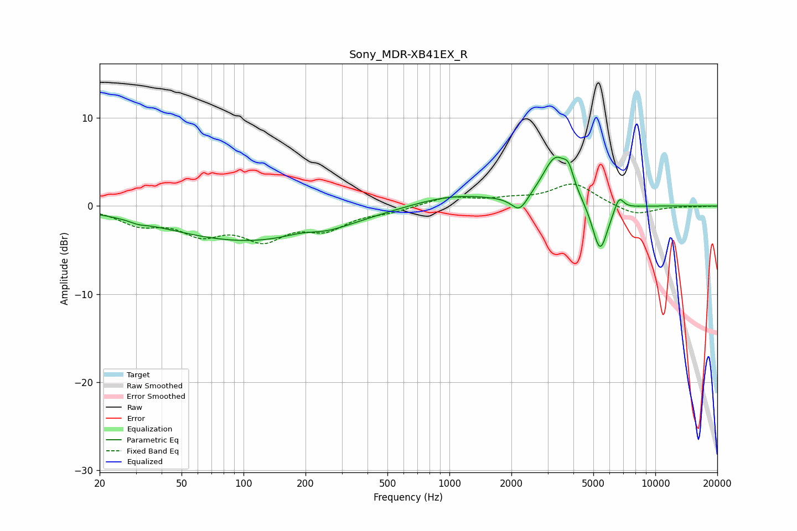

# Sony_MDR-XB41EX_R
See [usage instructions](https://github.com/jaakkopasanen/AutoEq#usage) for more options and info.

### Parametric EQs
Apply preamp of -5.6 dB when using parametric equalizer.

|   # | Type    |   Fc (Hz) |    Q |   Gain (dB) |
|-----|---------|-----------|------|-------------|
|   1 | Peaking |        31 | 3.65 |        -0.3 |
|   2 | Peaking |       110 | 0.33 |        -4   |
|   3 | Peaking |       192 | 1.57 |         0.5 |
|   4 | Peaking |       255 | 1.44 |        -0.4 |
|   5 | Peaking |      1046 | 0.68 |         1.3 |
|   6 | Peaking |      2192 | 3.6  |        -1.8 |
|   7 | Peaking |      3282 | 2.2  |         5.4 |
|   8 | Peaking |      3795 | 5.97 |         1.8 |
|   9 | Peaking |      5389 | 3.62 |        -5.7 |
|  10 | Peaking |      6664 | 5.91 |         1.7 |

### Fixed Band EQs
When using fixed band (also called graphic) equalizer, apply preamp of **-2.6 dB** (if available) and set gains manually with these parameters.

|   # | Type    |   Fc (Hz) |    Q |   Gain (dB) |
|-----|---------|-----------|------|-------------|
|   1 | Peaking |        31 | 1.41 |        -1.8 |
|   2 | Peaking |        62 | 1.41 |        -2.7 |
|   3 | Peaking |       125 | 1.41 |        -3.3 |
|   4 | Peaking |       250 | 1.41 |        -2.3 |
|   5 | Peaking |       500 | 1.41 |        -0.6 |
|   6 | Peaking |      1000 | 1.41 |         1   |
|   7 | Peaking |      2000 | 1.41 |         0.6 |
|   8 | Peaking |      4000 | 1.41 |         2.5 |
|   9 | Peaking |      8000 | 1.41 |        -1.1 |
|  10 | Peaking |     16000 | 1.41 |        -0   |

### Graphs

