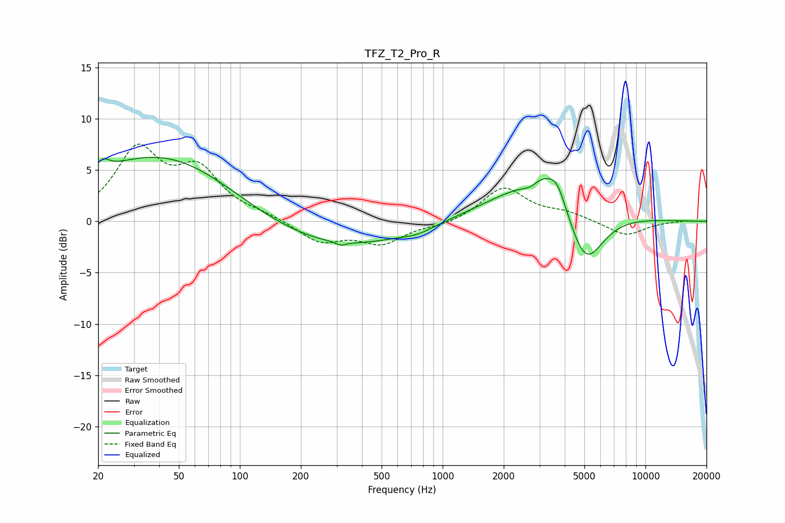

# TFZ_T2_Pro_R
See [usage instructions](https://github.com/jaakkopasanen/AutoEq#usage) for more options and info.

### Parametric EQs
Apply preamp of -6.3 dB when using parametric equalizer.

|   # | Type    |   Fc (Hz) |    Q |   Gain (dB) |
|-----|---------|-----------|------|-------------|
|   1 | Peaking |        21 | 4.44 |         1.1 |
|   2 | Peaking |        45 | 0.35 |         7.2 |
|   3 | Peaking |       215 | 0.31 |        -3.4 |
|   4 | Peaking |       314 | 5.91 |        -0.3 |
|   5 | Peaking |       758 | 2.02 |        -0.4 |
|   6 | Peaking |      2703 | 3.58 |        -0.6 |
|   7 | Peaking |      3016 | 0.56 |         4   |
|   8 | Peaking |      3106 | 2    |         1.4 |
|   9 | Peaking |      3666 | 3.07 |         2.1 |
|  10 | Peaking |      5049 | 1.5  |        -6.4 |

### Fixed Band EQs
When using fixed band (also called graphic) equalizer, apply preamp of **-7.6 dB** (if available) and set gains manually with these parameters.

|   # | Type    |   Fc (Hz) |    Q |   Gain (dB) |
|-----|---------|-----------|------|-------------|
|   1 | Peaking |        31 | 1.41 |         6.7 |
|   2 | Peaking |        62 | 1.41 |         4.5 |
|   3 | Peaking |       125 | 1.41 |         0.5 |
|   4 | Peaking |       250 | 1.41 |        -2   |
|   5 | Peaking |       500 | 1.41 |        -2   |
|   6 | Peaking |      1000 | 1.41 |        -0.4 |
|   7 | Peaking |      2000 | 1.41 |         3.3 |
|   8 | Peaking |      4000 | 1.41 |         0.7 |
|   9 | Peaking |      8000 | 1.41 |        -1.4 |
|  10 | Peaking |     16000 | 1.41 |         0.1 |

### Graphs

