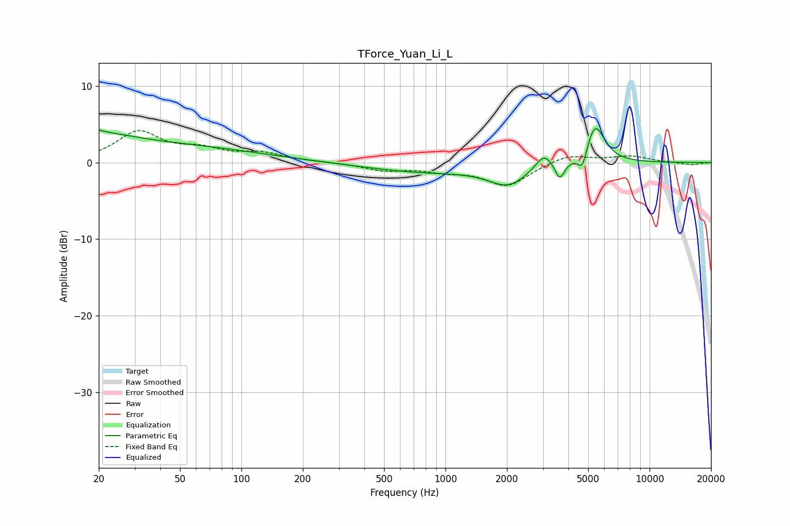

# TForce_Yuan_Li_L
See [usage instructions](https://github.com/jaakkopasanen/AutoEq#usage) for more options and info.

### Parametric EQs
Apply preamp of -4.5 dB when using parametric equalizer.

|   # | Type    |   Fc (Hz) |    Q |   Gain (dB) |
|-----|---------|-----------|------|-------------|
|   1 | Peaking |        20 | 5.71 |         2.4 |
|   2 | Peaking |        20 | 0.85 |         1.4 |
|   3 | Peaking |        20 | 5.99 |        -1.9 |
|   4 | Peaking |        24 | 0.19 |         2.4 |
|   5 | Peaking |       793 | 0.5  |        -1.2 |
|   6 | Peaking |      2029 | 1.46 |        -2.6 |
|   7 | Peaking |      3041 | 3.41 |         2   |
|   8 | Peaking |      3630 | 5.96 |        -2.4 |
|   9 | Peaking |      4692 | 6    |        -2.6 |
|  10 | Peaking |      5400 | 2.91 |         5.2 |

### Fixed Band EQs
When using fixed band (also called graphic) equalizer, apply preamp of **-4.3 dB** (if available) and set gains manually with these parameters.

|   # | Type    |   Fc (Hz) |    Q |   Gain (dB) |
|-----|---------|-----------|------|-------------|
|   1 | Peaking |        31 | 1.41 |         3.9 |
|   2 | Peaking |        62 | 1.41 |         1.4 |
|   3 | Peaking |       125 | 1.41 |         1.1 |
|   4 | Peaking |       250 | 1.41 |         0.1 |
|   5 | Peaking |       500 | 1.41 |        -0.9 |
|   6 | Peaking |      1000 | 1.41 |        -0.9 |
|   7 | Peaking |      2000 | 1.41 |        -3   |
|   8 | Peaking |      4000 | 1.41 |         1.1 |
|   9 | Peaking |      8000 | 1.41 |         0.8 |
|  10 | Peaking |     16000 | 1.41 |        -0.3 |

### Graphs

