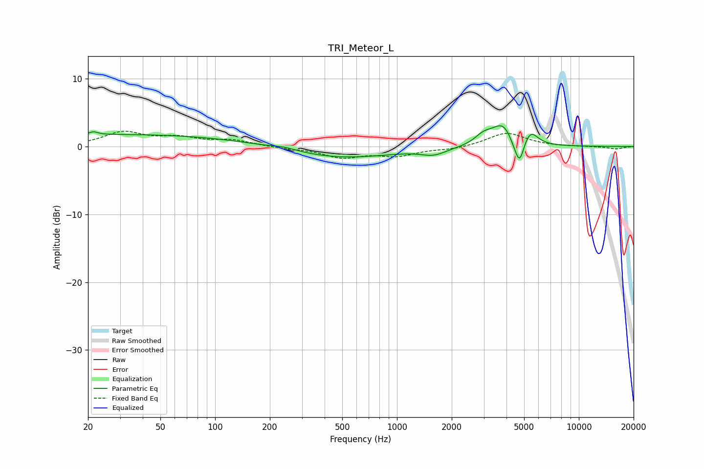

# TRI_Meteor_L
See [usage instructions](https://github.com/jaakkopasanen/AutoEq#usage) for more options and info.

### Parametric EQs
Apply preamp of -3.2 dB when using parametric equalizer.

|   # | Type    |   Fc (Hz) |    Q |   Gain (dB) |
|-----|---------|-----------|------|-------------|
|   1 | Peaking |        21 | 6    |         0.4 |
|   2 | Peaking |        31 | 0.18 |         1.8 |
|   3 | Peaking |       239 | 2.06 |         0.4 |
|   4 | Peaking |       487 | 0.49 |        -1.7 |
|   5 | Peaking |      1592 | 2.07 |        -0.9 |
|   6 | Peaking |      2987 | 2.95 |         1.3 |
|   7 | Peaking |      3831 | 2.33 |         3.3 |
|   8 | Peaking |      4433 | 4.54 |        -1.2 |
|   9 | Peaking |      4730 | 6    |        -3.3 |
|  10 | Peaking |      5432 | 3.66 |         2   |

### Fixed Band EQs
When using fixed band (also called graphic) equalizer, apply preamp of **-2.4 dB** (if available) and set gains manually with these parameters.

|   # | Type    |   Fc (Hz) |    Q |   Gain (dB) |
|-----|---------|-----------|------|-------------|
|   1 | Peaking |        31 | 1.41 |         2   |
|   2 | Peaking |        62 | 1.41 |         1.1 |
|   3 | Peaking |       125 | 1.41 |         0.8 |
|   4 | Peaking |       250 | 1.41 |        -0.2 |
|   5 | Peaking |       500 | 1.41 |        -1.5 |
|   6 | Peaking |      1000 | 1.41 |        -1.2 |
|   7 | Peaking |      2000 | 1.41 |        -0.4 |
|   8 | Peaking |      4000 | 1.41 |         2   |
|   9 | Peaking |      8000 | 1.41 |        -0   |
|  10 | Peaking |     16000 | 1.41 |        -0.4 |

### Graphs

