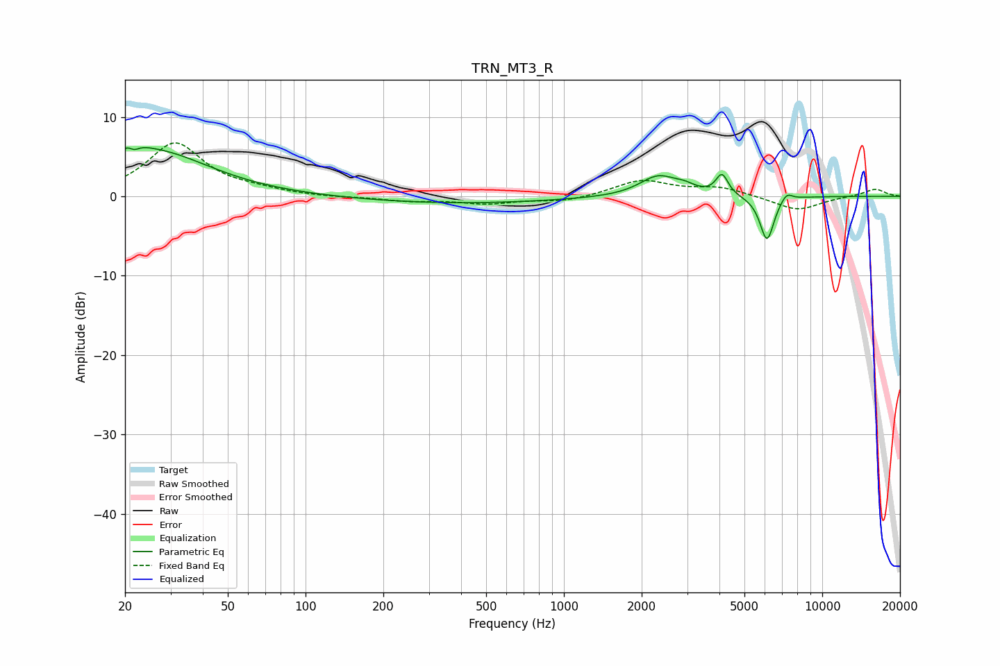

# TRN_MT3_R
See [usage instructions](https://github.com/jaakkopasanen/AutoEq#usage) for more options and info.

### Parametric EQs
Apply preamp of -6.2 dB when using parametric equalizer.

|   # | Type    |   Fc (Hz) |    Q |   Gain (dB) |
|-----|---------|-----------|------|-------------|
|   1 | Peaking |        21 | 5.78 |         1.9 |
|   2 | Peaking |        21 | 5.81 |        -2.4 |
|   3 | Peaking |        21 | 2.74 |         1.6 |
|   4 | Peaking |        26 | 0.67 |         5.4 |
|   5 | Peaking |       386 | 0.37 |        -0.9 |
|   6 | Peaking |      2321 | 1.95 |         2.6 |
|   7 | Peaking |      2944 | 3.51 |         0.7 |
|   8 | Peaking |      4093 | 6    |         2.6 |
|   9 | Peaking |      6111 | 5.01 |        -5.7 |
|  10 | Peaking |      7271 | 5.98 |         1.1 |

### Fixed Band EQs
When using fixed band (also called graphic) equalizer, apply preamp of **-6.8 dB** (if available) and set gains manually with these parameters.

|   # | Type    |   Fc (Hz) |    Q |   Gain (dB) |
|-----|---------|-----------|------|-------------|
|   1 | Peaking |        31 | 1.41 |         6.6 |
|   2 | Peaking |        62 | 1.41 |         0.5 |
|   3 | Peaking |       125 | 1.41 |        -0.1 |
|   4 | Peaking |       250 | 1.41 |        -0.5 |
|   5 | Peaking |       500 | 1.41 |        -0.9 |
|   6 | Peaking |      1000 | 1.41 |        -0.7 |
|   7 | Peaking |      2000 | 1.41 |         2   |
|   8 | Peaking |      4000 | 1.41 |         1.1 |
|   9 | Peaking |      8000 | 1.41 |        -1.8 |
|  10 | Peaking |     16000 | 1.41 |         1   |

### Graphs

