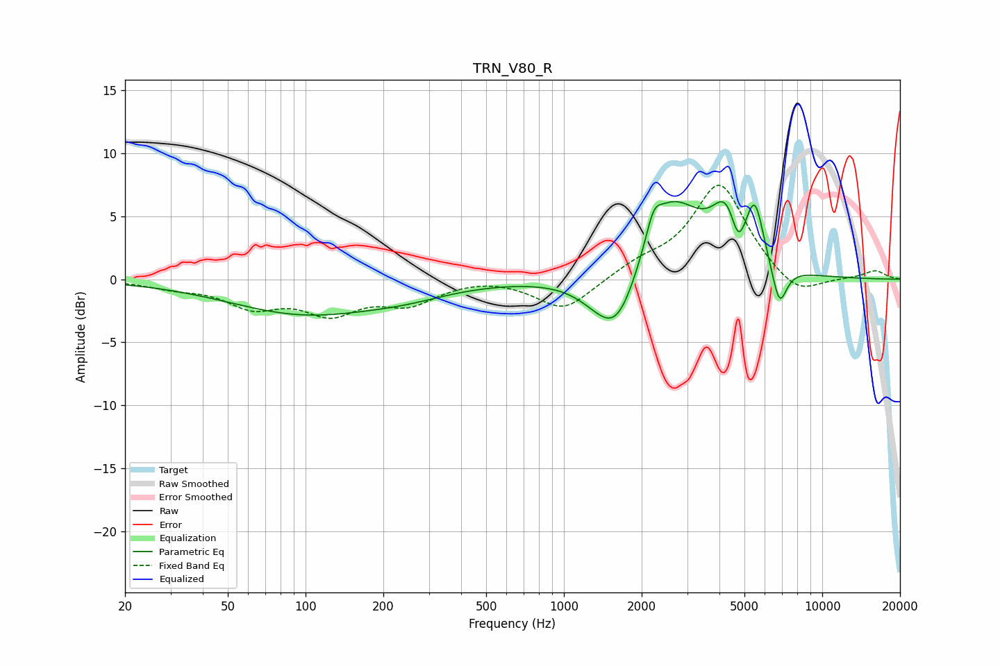

# TRN_V80_R
See [usage instructions](https://github.com/jaakkopasanen/AutoEq#usage) for more options and info.

### Parametric EQs
Apply preamp of -6.3 dB when using parametric equalizer.

|   # | Type    |   Fc (Hz) |    Q |   Gain (dB) |
|-----|---------|-----------|------|-------------|
|   1 | Peaking |        99 | 0.48 |        -2.7 |
|   2 | Peaking |       247 | 0.83 |        -0.7 |
|   3 | Peaking |      1309 | 1.77 |        -0.4 |
|   4 | Peaking |      1606 | 1.53 |        -5.8 |
|   5 | Peaking |      2225 | 4.86 |         1.9 |
|   6 | Peaking |      2576 | 1.13 |         6.9 |
|   7 | Peaking |      4256 | 2.59 |         3.9 |
|   8 | Peaking |      4727 | 5.17 |        -2.3 |
|   9 | Peaking |      5486 | 4.1  |         4.5 |
|  10 | Peaking |      6828 | 4.67 |        -3.3 |

### Fixed Band EQs
When using fixed band (also called graphic) equalizer, apply preamp of **-7.6 dB** (if available) and set gains manually with these parameters.

|   # | Type    |   Fc (Hz) |    Q |   Gain (dB) |
|-----|---------|-----------|------|-------------|
|   1 | Peaking |        31 | 1.41 |        -0.5 |
|   2 | Peaking |        62 | 1.41 |        -1.9 |
|   3 | Peaking |       125 | 1.41 |        -2.4 |
|   4 | Peaking |       250 | 1.41 |        -1.7 |
|   5 | Peaking |       500 | 1.41 |         0.2 |
|   6 | Peaking |      1000 | 1.41 |        -2.5 |
|   7 | Peaking |      2000 | 1.41 |         1   |
|   8 | Peaking |      4000 | 1.41 |         7.6 |
|   9 | Peaking |      8000 | 1.41 |        -1.6 |
|  10 | Peaking |     16000 | 1.41 |         0.7 |

### Graphs

