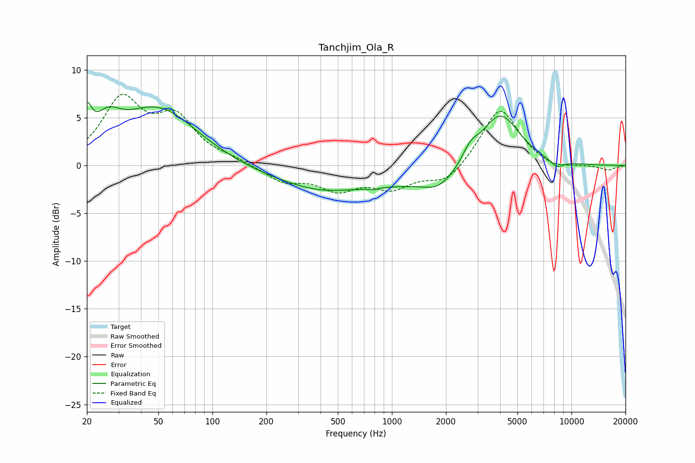

# Tanchjim_Ola_R
See [usage instructions](https://github.com/jaakkopasanen/AutoEq#usage) for more options and info.

### Parametric EQs
Apply preamp of -6.7 dB when using parametric equalizer.

|   # | Type    |   Fc (Hz) |    Q |   Gain (dB) |
|-----|---------|-----------|------|-------------|
|   1 | Peaking |        20 | 5.56 |         3.3 |
|   2 | Peaking |        26 | 2.02 |         2.5 |
|   3 | Peaking |        50 | 0.64 |         6   |
|   4 | Peaking |       389 | 0.76 |        -0.8 |
|   5 | Peaking |       790 | 6    |        -0.2 |
|   6 | Peaking |       805 | 0.19 |        -2.1 |
|   7 | Peaking |      1818 | 1.63 |        -1.4 |
|   8 | Peaking |      2737 | 3.28 |         1.4 |
|   9 | Peaking |      3991 | 1.22 |         6.3 |
|  10 | Peaking |      8277 | 3.51 |        -0.8 |

### Fixed Band EQs
When using fixed band (also called graphic) equalizer, apply preamp of **-7.6 dB** (if available) and set gains manually with these parameters.

|   # | Type    |   Fc (Hz) |    Q |   Gain (dB) |
|-----|---------|-----------|------|-------------|
|   1 | Peaking |        31 | 1.41 |         6.6 |
|   2 | Peaking |        62 | 1.41 |         4.5 |
|   3 | Peaking |       125 | 1.41 |         0.5 |
|   4 | Peaking |       250 | 1.41 |        -1.6 |
|   5 | Peaking |       500 | 1.41 |        -2.3 |
|   6 | Peaking |      1000 | 1.41 |        -2.1 |
|   7 | Peaking |      2000 | 1.41 |        -1.9 |
|   8 | Peaking |      4000 | 1.41 |         6.2 |
|   9 | Peaking |      8000 | 1.41 |        -0.6 |
|  10 | Peaking |     16000 | 1.41 |        -0.5 |

### Graphs

