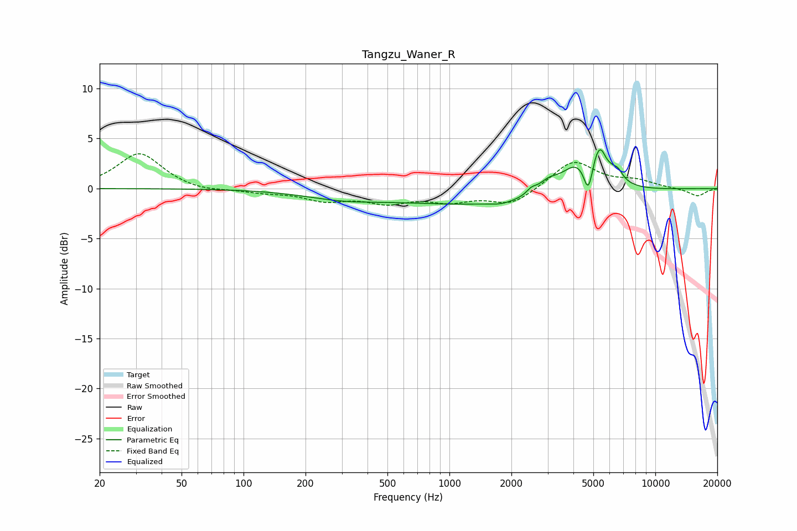

# Tangzu_Waner_R
See [usage instructions](https://github.com/jaakkopasanen/AutoEq#usage) for more options and info.

### Parametric EQs
Apply preamp of -4.0 dB when using parametric equalizer.

|   # | Type    |   Fc (Hz) |    Q |   Gain (dB) |
|-----|---------|-----------|------|-------------|
|   1 | Peaking |       298 | 0.76 |        -0.7 |
|   2 | Peaking |      1560 | 0.29 |        -1.6 |
|   3 | Peaking |      1788 | 2.68 |        -0.3 |
|   4 | Peaking |      2504 | 6    |         0.5 |
|   5 | Peaking |      3011 | 2.86 |         1.1 |
|   6 | Peaking |      4128 | 1.72 |         2.7 |
|   7 | Peaking |      4734 | 6    |        -3.5 |
|   8 | Peaking |      5411 | 2.95 |         4.6 |
|   9 | Peaking |      5751 | 6    |        -0.8 |
|  10 | Peaking |      6598 | 6    |         0.7 |

### Fixed Band EQs
When using fixed band (also called graphic) equalizer, apply preamp of **-3.6 dB** (if available) and set gains manually with these parameters.

|   # | Type    |   Fc (Hz) |    Q |   Gain (dB) |
|-----|---------|-----------|------|-------------|
|   1 | Peaking |        31 | 1.41 |         3.6 |
|   2 | Peaking |        62 | 1.41 |        -0.4 |
|   3 | Peaking |       125 | 1.41 |        -0.4 |
|   4 | Peaking |       250 | 1.41 |        -1.1 |
|   5 | Peaking |       500 | 1.41 |        -1.2 |
|   6 | Peaking |      1000 | 1.41 |        -1.1 |
|   7 | Peaking |      2000 | 1.41 |        -1.6 |
|   8 | Peaking |      4000 | 1.41 |         2.8 |
|   9 | Peaking |      8000 | 1.41 |         0.7 |
|  10 | Peaking |     16000 | 1.41 |        -0.8 |

### Graphs

