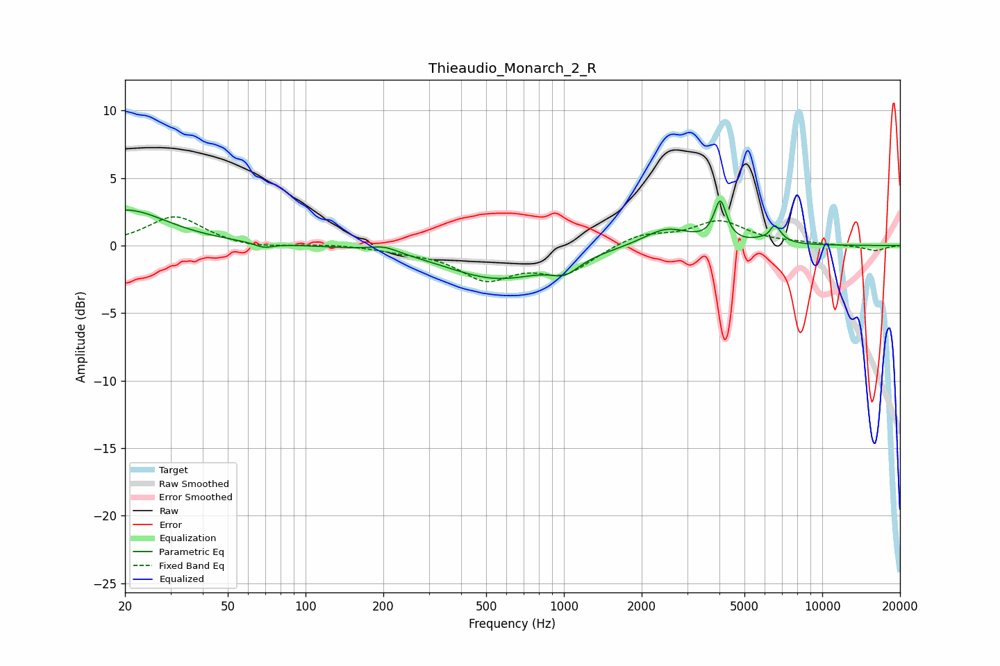

# Thieaudio_Monarch_2_R
See [usage instructions](https://github.com/jaakkopasanen/AutoEq#usage) for more options and info.

### Parametric EQs
Apply preamp of -3.4 dB when using parametric equalizer.

|   # | Type    |   Fc (Hz) |    Q |   Gain (dB) |
|-----|---------|-----------|------|-------------|
|   1 | Peaking |        20 | 0.87 |         2.6 |
|   2 | Peaking |        69 | 3.86 |        -0.4 |
|   3 | Peaking |       202 | 2.51 |         0.5 |
|   4 | Peaking |       554 | 0.71 |        -2.4 |
|   5 | Peaking |      1011 | 2.62 |        -1   |
|   6 | Peaking |      2497 | 1.53 |         1.4 |
|   7 | Peaking |      4030 | 6    |         3   |
|   8 | Peaking |      6176 | 3.27 |         0.5 |
|   9 | Peaking |      6274 | 5.64 |        -0.8 |
|  10 | Peaking |      6497 | 5.7  |         1.6 |

### Fixed Band EQs
When using fixed band (also called graphic) equalizer, apply preamp of **-2.2 dB** (if available) and set gains manually with these parameters.

|   # | Type    |   Fc (Hz) |    Q |   Gain (dB) |
|-----|---------|-----------|------|-------------|
|   1 | Peaking |        31 | 1.41 |         2.2 |
|   2 | Peaking |        62 | 1.41 |        -0.3 |
|   3 | Peaking |       125 | 1.41 |         0.1 |
|   4 | Peaking |       250 | 1.41 |        -0.3 |
|   5 | Peaking |       500 | 1.41 |        -2.3 |
|   6 | Peaking |      1000 | 1.41 |        -2   |
|   7 | Peaking |      2000 | 1.41 |         0.9 |
|   8 | Peaking |      4000 | 1.41 |         1.7 |
|   9 | Peaking |      8000 | 1.41 |         0.1 |
|  10 | Peaking |     16000 | 1.41 |        -0.4 |

### Graphs

