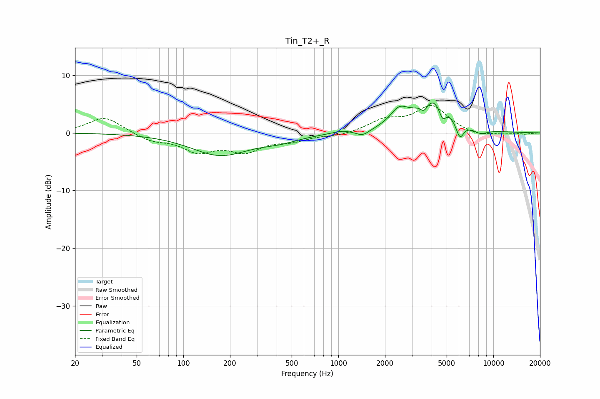

# Tin_T2+_R
See [usage instructions](https://github.com/jaakkopasanen/AutoEq#usage) for more options and info.

### Parametric EQs
Apply preamp of -5.3 dB when using parametric equalizer.

|   # | Type    |   Fc (Hz) |    Q |   Gain (dB) |
|-----|---------|-----------|------|-------------|
|   1 | Peaking |       173 | 0.76 |        -3.8 |
|   2 | Peaking |       422 | 1.13 |        -1   |
|   3 | Peaking |      1050 | 2.55 |         0.4 |
|   4 | Peaking |      1436 | 3.27 |        -1   |
|   5 | Peaking |      2460 | 2.49 |         2.7 |
|   6 | Peaking |      3572 | 6    |        -1.6 |
|   7 | Peaking |      4114 | 1.26 |         6   |
|   8 | Peaking |      4701 | 6    |        -2.4 |
|   9 | Peaking |      6082 | 5.23 |        -3   |
|  10 | Peaking |      8217 | 2.68 |        -1   |

### Fixed Band EQs
When using fixed band (also called graphic) equalizer, apply preamp of **-4.9 dB** (if available) and set gains manually with these parameters.

|   # | Type    |   Fc (Hz) |    Q |   Gain (dB) |
|-----|---------|-----------|------|-------------|
|   1 | Peaking |        31 | 1.41 |         2.8 |
|   2 | Peaking |        62 | 1.41 |        -1.3 |
|   3 | Peaking |       125 | 1.41 |        -2.9 |
|   4 | Peaking |       250 | 1.41 |        -2.9 |
|   5 | Peaking |       500 | 1.41 |        -1.1 |
|   6 | Peaking |      1000 | 1.41 |        -0.5 |
|   7 | Peaking |      2000 | 1.41 |         2   |
|   8 | Peaking |      4000 | 1.41 |         4.5 |
|   9 | Peaking |      8000 | 1.41 |        -0.7 |
|  10 | Peaking |     16000 | 1.41 |        -0.2 |

### Graphs

