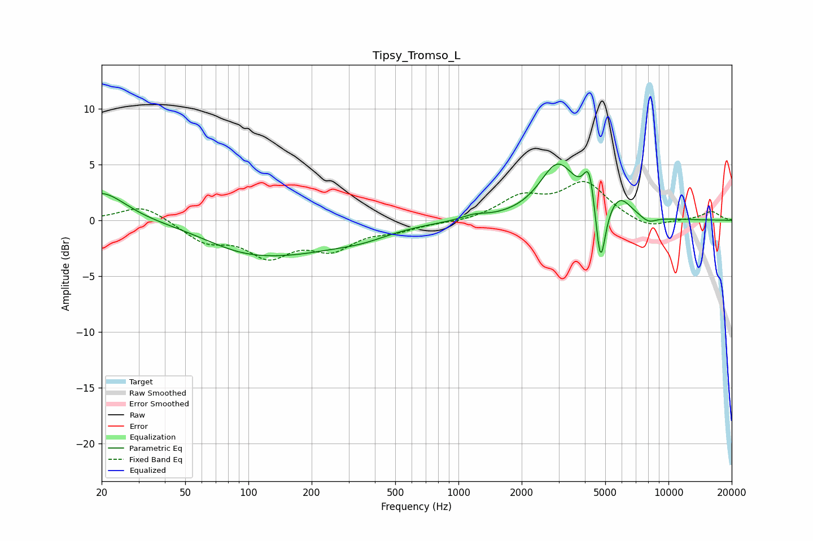

# Tipsy_Tromso_L
See [usage instructions](https://github.com/jaakkopasanen/AutoEq#usage) for more options and info.

### Parametric EQs
Apply preamp of -5.1 dB when using parametric equalizer.

|   # | Type    |   Fc (Hz) |    Q |   Gain (dB) |
|-----|---------|-----------|------|-------------|
|   1 | Peaking |        20 | 1.24 |         2.6 |
|   2 | Peaking |        90 | 0.75 |        -1.5 |
|   3 | Peaking |       169 | 0.55 |        -2.2 |
|   4 | Peaking |       349 | 1.04 |        -0.7 |
|   5 | Peaking |      1184 | 2.51 |         0.4 |
|   6 | Peaking |      2973 | 1.63 |         4.9 |
|   7 | Peaking |      4195 | 5.36 |         3.5 |
|   8 | Peaking |      4743 | 6    |        -6   |
|   9 | Peaking |      5884 | 2.65 |         1.7 |
|  10 | Peaking |      8026 | 3.41 |        -0.6 |

### Fixed Band EQs
When using fixed band (also called graphic) equalizer, apply preamp of **-3.6 dB** (if available) and set gains manually with these parameters.

|   # | Type    |   Fc (Hz) |    Q |   Gain (dB) |
|-----|---------|-----------|------|-------------|
|   1 | Peaking |        31 | 1.41 |         1.4 |
|   2 | Peaking |        62 | 1.41 |        -1.7 |
|   3 | Peaking |       125 | 1.41 |        -2.9 |
|   4 | Peaking |       250 | 1.41 |        -2.2 |
|   5 | Peaking |       500 | 1.41 |        -0.7 |
|   6 | Peaking |      1000 | 1.41 |        -0.2 |
|   7 | Peaking |      2000 | 1.41 |         1.9 |
|   8 | Peaking |      4000 | 1.41 |         3.3 |
|   9 | Peaking |      8000 | 1.41 |        -0.8 |
|  10 | Peaking |     16000 | 1.41 |         0.8 |

### Graphs

