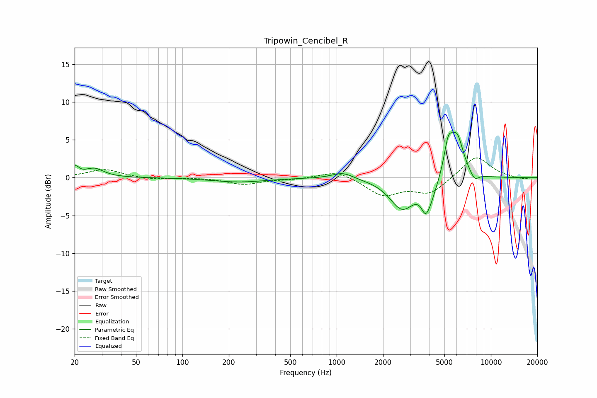

# Tripowin_Cencibel_R
See [usage instructions](https://github.com/jaakkopasanen/AutoEq#usage) for more options and info.

### Parametric EQs
Apply preamp of -6.1 dB when using parametric equalizer.

|   # | Type    |   Fc (Hz) |    Q |   Gain (dB) |
|-----|---------|-----------|------|-------------|
|   1 | Peaking |        20 | 5.88 |         1.2 |
|   2 | Peaking |        27 | 2.34 |         1.2 |
|   3 | Peaking |       232 | 0.82 |        -0.6 |
|   4 | Peaking |      1093 | 2.06 |         0.9 |
|   5 | Peaking |      2659 | 1.74 |        -4   |
|   6 | Peaking |      3754 | 5.92 |        -1.6 |
|   7 | Peaking |      3987 | 3.17 |        -2.7 |
|   8 | Peaking |      5293 | 4.96 |         3.8 |
|   9 | Peaking |      6032 | 3.2  |         5.3 |
|  10 | Peaking |      7836 | 4.82 |        -1   |

### Fixed Band EQs
When using fixed band (also called graphic) equalizer, apply preamp of **-2.7 dB** (if available) and set gains manually with these parameters.

|   # | Type    |   Fc (Hz) |    Q |   Gain (dB) |
|-----|---------|-----------|------|-------------|
|   1 | Peaking |        31 | 1.41 |         1.1 |
|   2 | Peaking |        62 | 1.41 |        -0.3 |
|   3 | Peaking |       125 | 1.41 |         0   |
|   4 | Peaking |       250 | 1.41 |        -0.9 |
|   5 | Peaking |       500 | 1.41 |        -0.2 |
|   6 | Peaking |      1000 | 1.41 |         1   |
|   7 | Peaking |      2000 | 1.41 |        -2.3 |
|   8 | Peaking |      4000 | 1.41 |        -2   |
|   9 | Peaking |      8000 | 1.41 |         2.9 |
|  10 | Peaking |     16000 | 1.41 |        -0.2 |

### Graphs

