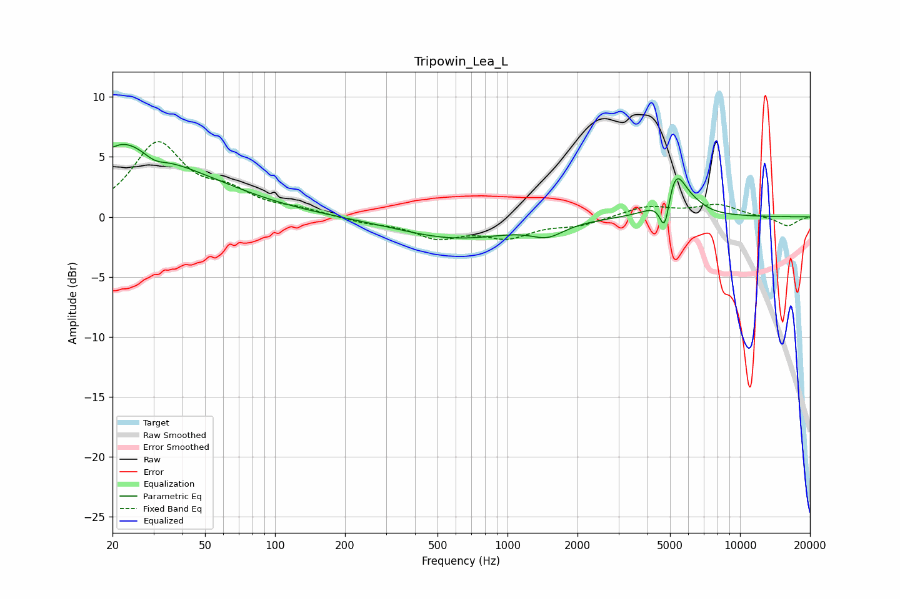

# Tripowin_Lea_L
See [usage instructions](https://github.com/jaakkopasanen/AutoEq#usage) for more options and info.

### Parametric EQs
Apply preamp of -6.1 dB when using parametric equalizer.

|   # | Type    |   Fc (Hz) |    Q |   Gain (dB) |
|-----|---------|-----------|------|-------------|
|   1 | Peaking |        20 | 0.75 |         5   |
|   2 | Peaking |        20 | 5.91 |        -3.6 |
|   3 | Peaking |        20 | 5.96 |         3.2 |
|   4 | Peaking |        30 | 2.81 |        -0.8 |
|   5 | Peaking |        42 | 0.51 |         2.2 |
|   6 | Peaking |       600 | 0.57 |        -1.8 |
|   7 | Peaking |      1488 | 2.03 |        -1   |
|   8 | Peaking |      4756 | 6    |        -3.7 |
|   9 | Peaking |      5205 | 2.73 |         4.4 |
|  10 | Peaking |      6511 | 3.22 |         0.3 |

### Fixed Band EQs
When using fixed band (also called graphic) equalizer, apply preamp of **-6.4 dB** (if available) and set gains manually with these parameters.

|   # | Type    |   Fc (Hz) |    Q |   Gain (dB) |
|-----|---------|-----------|------|-------------|
|   1 | Peaking |        31 | 1.41 |         5.9 |
|   2 | Peaking |        62 | 1.41 |         1.7 |
|   3 | Peaking |       125 | 1.41 |         0.5 |
|   4 | Peaking |       250 | 1.41 |        -0.4 |
|   5 | Peaking |       500 | 1.41 |        -1.6 |
|   6 | Peaking |      1000 | 1.41 |        -1.5 |
|   7 | Peaking |      2000 | 1.41 |        -0.6 |
|   8 | Peaking |      4000 | 1.41 |         0.9 |
|   9 | Peaking |      8000 | 1.41 |         1   |
|  10 | Peaking |     16000 | 1.41 |        -0.8 |

### Graphs

