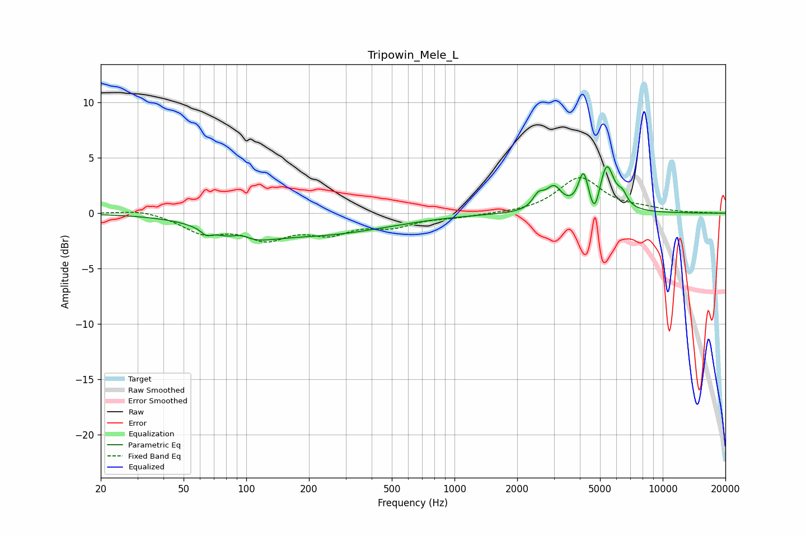

# Tripowin_Mele_L
See [usage instructions](https://github.com/jaakkopasanen/AutoEq#usage) for more options and info.

### Parametric EQs
Apply preamp of -4.3 dB when using parametric equalizer.

|   # | Type    |   Fc (Hz) |    Q |   Gain (dB) |
|-----|---------|-----------|------|-------------|
|   1 | Peaking |        64 | 5.99 |        -0.5 |
|   2 | Peaking |        94 | 3.07 |         0.7 |
|   3 | Peaking |        94 | 1.04 |        -1.8 |
|   4 | Peaking |       238 | 0.44 |        -1.7 |
|   5 | Peaking |      2528 | 5.16 |         1.2 |
|   6 | Peaking |      3002 | 3.71 |         2   |
|   7 | Peaking |      4164 | 5.99 |         3.2 |
|   8 | Peaking |      4706 | 6    |        -2   |
|   9 | Peaking |      5381 | 4.01 |         4.2 |
|  10 | Peaking |      6408 | 6    |         1   |

### Fixed Band EQs
When using fixed band (also called graphic) equalizer, apply preamp of **-3.3 dB** (if available) and set gains manually with these parameters.

|   # | Type    |   Fc (Hz) |    Q |   Gain (dB) |
|-----|---------|-----------|------|-------------|
|   1 | Peaking |        31 | 1.41 |         0.4 |
|   2 | Peaking |        62 | 1.41 |        -1.6 |
|   3 | Peaking |       125 | 1.41 |        -2   |
|   4 | Peaking |       250 | 1.41 |        -1.5 |
|   5 | Peaking |       500 | 1.41 |        -1   |
|   6 | Peaking |      1000 | 1.41 |        -0.3 |
|   7 | Peaking |      2000 | 1.41 |        -0   |
|   8 | Peaking |      4000 | 1.41 |         3.2 |
|   9 | Peaking |      8000 | 1.41 |         0.3 |
|  10 | Peaking |     16000 | 1.41 |         0   |

### Graphs

