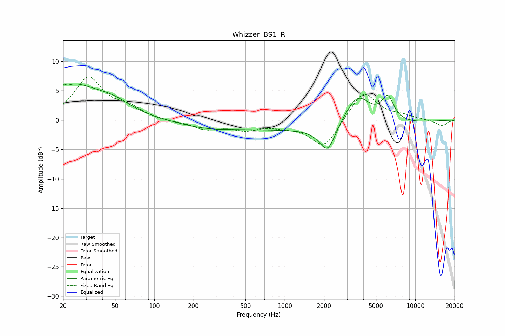

# Whizzer_BS1_R
See [usage instructions](https://github.com/jaakkopasanen/AutoEq#usage) for more options and info.

### Parametric EQs
Apply preamp of -6.3 dB when using parametric equalizer.

|   # | Type    |   Fc (Hz) |    Q |   Gain (dB) |
|-----|---------|-----------|------|-------------|
|   1 | Peaking |        21 | 5.97 |         3.1 |
|   2 | Peaking |        21 | 5.92 |        -3.3 |
|   3 | Peaking |        22 | 0.61 |         6   |
|   4 | Peaking |        49 | 1.09 |         1.5 |
|   5 | Peaking |       241 | 0.68 |        -1   |
|   6 | Peaking |      1804 | 0.18 |        -1.7 |
|   7 | Peaking |      2016 | 3.65 |         0.5 |
|   8 | Peaking |      2111 | 2.33 |        -5.2 |
|   9 | Peaking |      3613 | 1.36 |         5.5 |
|  10 | Peaking |      6155 | 2.87 |         4.1 |

### Fixed Band EQs
When using fixed band (also called graphic) equalizer, apply preamp of **-7.4 dB** (if available) and set gains manually with these parameters.

|   # | Type    |   Fc (Hz) |    Q |   Gain (dB) |
|-----|---------|-----------|------|-------------|
|   1 | Peaking |        31 | 1.41 |         7   |
|   2 | Peaking |        62 | 1.41 |         1.8 |
|   3 | Peaking |       125 | 1.41 |        -0.3 |
|   4 | Peaking |       250 | 1.41 |        -1.5 |
|   5 | Peaking |       500 | 1.41 |        -1.4 |
|   6 | Peaking |      1000 | 1.41 |        -0.7 |
|   7 | Peaking |      2000 | 1.41 |        -4.8 |
|   8 | Peaking |      4000 | 1.41 |         5.1 |
|   9 | Peaking |      8000 | 1.41 |         0.6 |
|  10 | Peaking |     16000 | 1.41 |        -1   |

### Graphs

