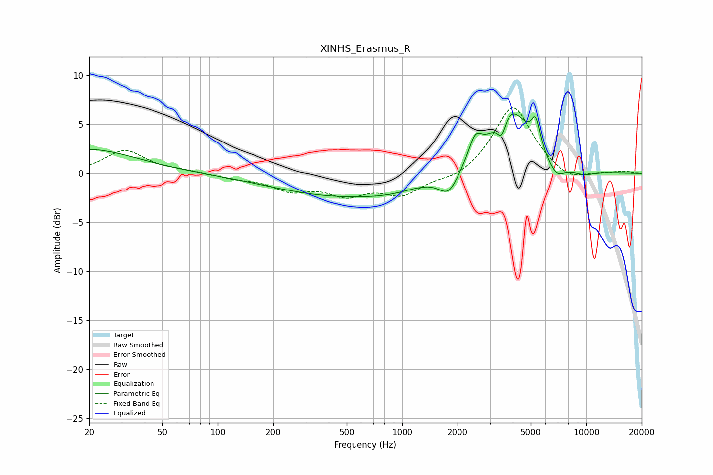

# XINHS_Erasmus_R
See [usage instructions](https://github.com/jaakkopasanen/AutoEq#usage) for more options and info.

### Parametric EQs
Apply preamp of -6.2 dB when using parametric equalizer.

|   # | Type    |   Fc (Hz) |    Q |   Gain (dB) |
|-----|---------|-----------|------|-------------|
|   1 | Peaking |        20 | 0.56 |         2.4 |
|   2 | Peaking |       420 | 0.41 |        -2.1 |
|   3 | Peaking |       880 | 0.85 |        -0.8 |
|   4 | Peaking |      1790 | 2.63 |        -2.2 |
|   5 | Peaking |      2498 | 3.97 |         2.3 |
|   6 | Peaking |      3465 | 5.99 |        -2   |
|   7 | Peaking |      3862 | 1.32 |         6.7 |
|   8 | Peaking |      5321 | 5.96 |         2.7 |
|   9 | Peaking |      6856 | 2.82 |        -1.6 |
|  10 | Peaking |      9698 | 2.06 |        -0.5 |

### Fixed Band EQs
When using fixed band (also called graphic) equalizer, apply preamp of **-6.8 dB** (if available) and set gains manually with these parameters.

|   # | Type    |   Fc (Hz) |    Q |   Gain (dB) |
|-----|---------|-----------|------|-------------|
|   1 | Peaking |        31 | 1.41 |         2.3 |
|   2 | Peaking |        62 | 1.41 |         0.2 |
|   3 | Peaking |       125 | 1.41 |        -0.4 |
|   4 | Peaking |       250 | 1.41 |        -1.5 |
|   5 | Peaking |       500 | 1.41 |        -1.9 |
|   6 | Peaking |      1000 | 1.41 |        -2   |
|   7 | Peaking |      2000 | 1.41 |        -0.7 |
|   8 | Peaking |      4000 | 1.41 |         7   |
|   9 | Peaking |      8000 | 1.41 |        -1   |
|  10 | Peaking |     16000 | 1.41 |         0.2 |

### Graphs

