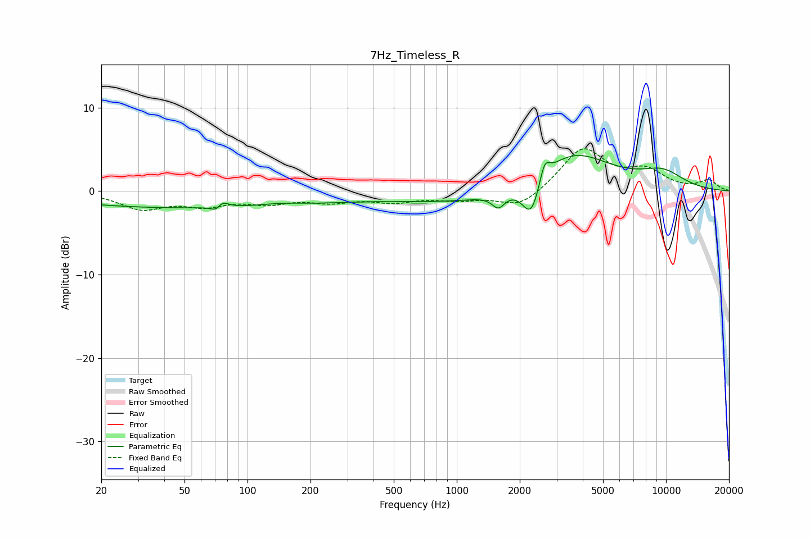

# 7Hz_Timeless_R
See [usage instructions](https://github.com/jaakkopasanen/AutoEq#usage) for more options and info.

### Parametric EQs
Apply preamp of -4.4 dB when using parametric equalizer.

|   # | Type    |   Fc (Hz) |    Q |   Gain (dB) |
|-----|---------|-----------|------|-------------|
|   1 | Peaking |        56 | 0.19 |        -2   |
|   2 | Peaking |        72 | 5.4  |        -1.9 |
|   3 | Peaking |        74 | 5.03 |         2   |
|   4 | Peaking |       141 | 1.3  |         0.4 |
|   5 | Peaking |      1405 | 0.37 |        -1.7 |
|   6 | Peaking |      1582 | 4.62 |        -1.6 |
|   7 | Peaking |      2273 | 3.26 |        -4.6 |
|   8 | Peaking |      2625 | 5.99 |         2.4 |
|   9 | Peaking |      3496 | 0.75 |         5.4 |
|  10 | Peaking |      9613 | 1.19 |         1.9 |

### Fixed Band EQs
When using fixed band (also called graphic) equalizer, apply preamp of **-5.2 dB** (if available) and set gains manually with these parameters.

|   # | Type    |   Fc (Hz) |    Q |   Gain (dB) |
|-----|---------|-----------|------|-------------|
|   1 | Peaking |        31 | 1.41 |        -2   |
|   2 | Peaking |        62 | 1.41 |        -1.5 |
|   3 | Peaking |       125 | 1.41 |        -1.2 |
|   4 | Peaking |       250 | 1.41 |        -1.1 |
|   5 | Peaking |       500 | 1.41 |        -1.1 |
|   6 | Peaking |      1000 | 1.41 |        -0.8 |
|   7 | Peaking |      2000 | 1.41 |        -2.1 |
|   8 | Peaking |      4000 | 1.41 |         5.1 |
|   9 | Peaking |      8000 | 1.41 |         2.2 |
|  10 | Peaking |     16000 | 1.41 |         1.2 |

### Graphs

