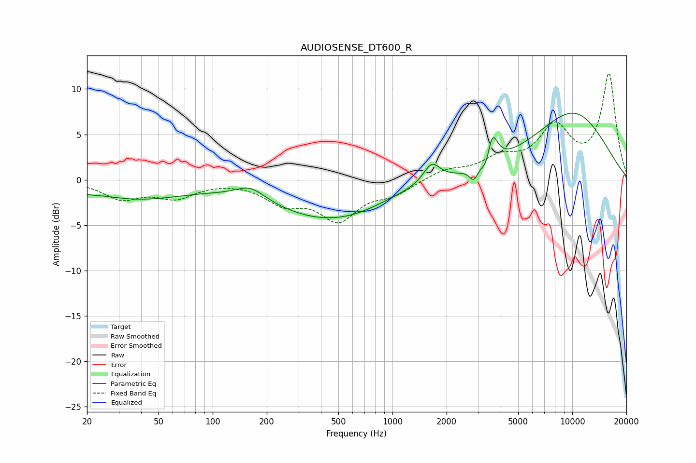

# AUDIOSENSE_DT600_R
See [usage instructions](https://github.com/jaakkopasanen/AutoEq#usage) for more options and info.

### Parametric EQs
Apply preamp of -7.4 dB when using parametric equalizer.

|   # | Type    |   Fc (Hz) |    Q |   Gain (dB) |
|-----|---------|-----------|------|-------------|
|   1 | Peaking |        20 | 2.94 |        -0.3 |
|   2 | Peaking |        38 | 0.52 |        -2   |
|   3 | Peaking |       162 | 1.81 |         1.4 |
|   4 | Peaking |       409 | 0.48 |        -4   |
|   5 | Peaking |       654 | 0.94 |        -0.5 |
|   6 | Peaking |      1654 | 3.04 |         2.2 |
|   7 | Peaking |      2830 | 5.97 |        -1.4 |
|   8 | Peaking |      3339 | 5.79 |        -1.7 |
|   9 | Peaking |      3571 | 4.68 |         3.7 |
|  10 | Peaking |     10000 | 0.53 |         7.3 |

### Fixed Band EQs
When using fixed band (also called graphic) equalizer, apply preamp of **-11.8 dB** (if available) and set gains manually with these parameters.

|   # | Type    |   Fc (Hz) |    Q |   Gain (dB) |
|-----|---------|-----------|------|-------------|
|   1 | Peaking |        31 | 1.41 |        -1.9 |
|   2 | Peaking |        62 | 1.41 |        -1.8 |
|   3 | Peaking |       125 | 1.41 |        -0   |
|   4 | Peaking |       250 | 1.41 |        -2.3 |
|   5 | Peaking |       500 | 1.41 |        -4.1 |
|   6 | Peaking |      1000 | 1.41 |        -1.4 |
|   7 | Peaking |      2000 | 1.41 |         1   |
|   8 | Peaking |      4000 | 1.41 |         2   |
|   9 | Peaking |      8000 | 1.41 |         5.4 |
|  10 | Peaking |     16000 | 1.41 |        11.5 |

### Graphs

