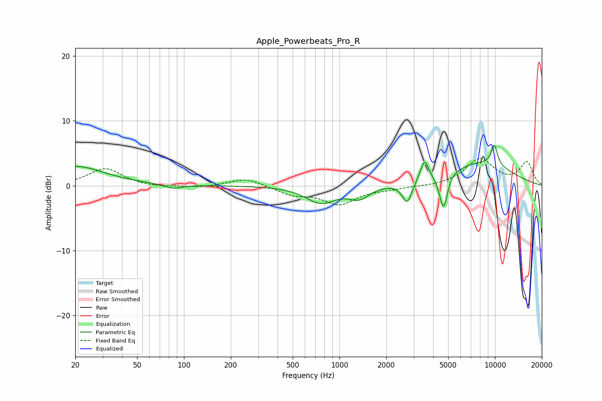

# Apple_Powerbeats_Pro_R
See [usage instructions](https://github.com/jaakkopasanen/AutoEq#usage) for more options and info.

### Parametric EQs
Apply preamp of -6.3 dB when using parametric equalizer.

|   # | Type    |   Fc (Hz) |    Q |   Gain (dB) |
|-----|---------|-----------|------|-------------|
|   1 | Peaking |        20 | 0.75 |         3   |
|   2 | Peaking |        85 | 2.51 |        -0.6 |
|   3 | Peaking |       759 | 1.46 |        -2.6 |
|   4 | Peaking |      1338 | 2.13 |        -1.7 |
|   5 | Peaking |      2724 | 4.61 |        -3.3 |
|   6 | Peaking |      3522 | 5.33 |         3.3 |
|   7 | Peaking |      4552 | 5.99 |        -1.8 |
|   8 | Peaking |      4712 | 5.91 |        -3.9 |
|   9 | Peaking |      8099 | 0.58 |         3.5 |
|  10 | Peaking |      9908 | 5.87 |         3.2 |

### Fixed Band EQs
When using fixed band (also called graphic) equalizer, apply preamp of **-4.3 dB** (if available) and set gains manually with these parameters.

|   # | Type    |   Fc (Hz) |    Q |   Gain (dB) |
|-----|---------|-----------|------|-------------|
|   1 | Peaking |        31 | 1.41 |         2.7 |
|   2 | Peaking |        62 | 1.41 |        -0.3 |
|   3 | Peaking |       125 | 1.41 |        -0.3 |
|   4 | Peaking |       250 | 1.41 |         1.2 |
|   5 | Peaking |       500 | 1.41 |        -1.3 |
|   6 | Peaking |      1000 | 1.41 |        -2.7 |
|   7 | Peaking |      2000 | 1.41 |        -0.4 |
|   8 | Peaking |      4000 | 1.41 |        -0.1 |
|   9 | Peaking |      8000 | 1.41 |         4.1 |
|  10 | Peaking |     16000 | 1.41 |         3.5 |

### Graphs

