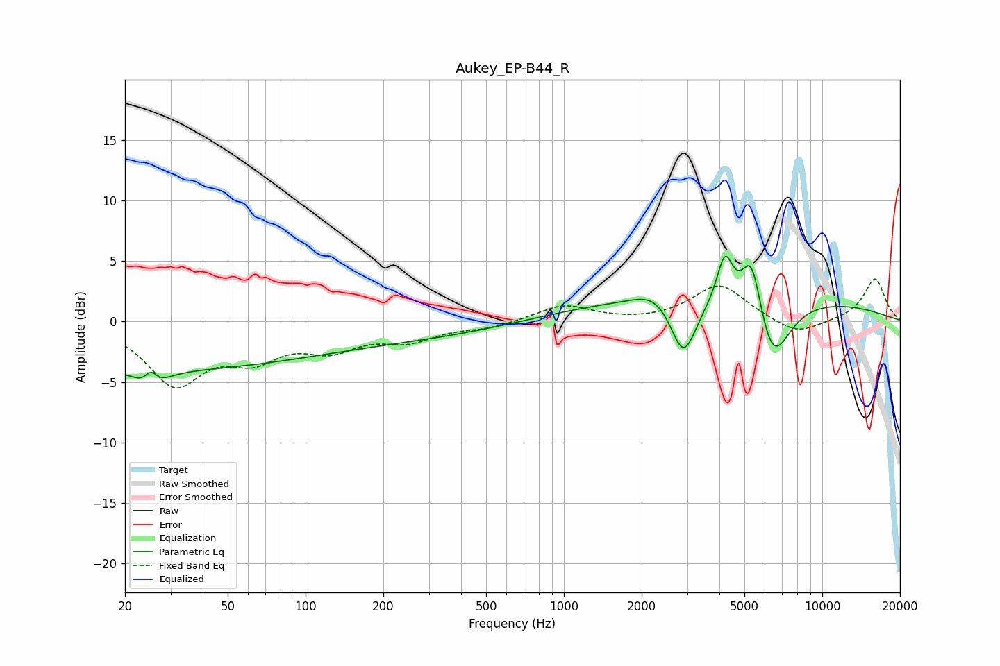

# Aukey_EP-B44_R
See [usage instructions](https://github.com/jaakkopasanen/AutoEq#usage) for more options and info.

### Parametric EQs
Apply preamp of -5.5 dB when using parametric equalizer.

|   # | Type    |   Fc (Hz) |    Q |   Gain (dB) |
|-----|---------|-----------|------|-------------|
|   1 | Peaking |        22 | 0.2  |        -3.9 |
|   2 | Peaking |        25 | 3.42 |        -3.4 |
|   3 | Peaking |        25 | 4.8  |         3.2 |
|   4 | Peaking |       278 | 0.35 |        -1.2 |
|   5 | Peaking |      2258 | 1.87 |         1.1 |
|   6 | Peaking |      2904 | 2.8  |        -4.9 |
|   7 | Peaking |      4199 | 4.56 |         4   |
|   8 | Peaking |      4240 | 0.18 |         2.1 |
|   9 | Peaking |      5333 | 3.58 |         5.1 |
|  10 | Peaking |      6415 | 2.05 |        -5.5 |

### Fixed Band EQs
When using fixed band (also called graphic) equalizer, apply preamp of **-3.6 dB** (if available) and set gains manually with these parameters.

|   # | Type    |   Fc (Hz) |    Q |   Gain (dB) |
|-----|---------|-----------|------|-------------|
|   1 | Peaking |        31 | 1.41 |        -4.9 |
|   2 | Peaking |        62 | 1.41 |        -2.5 |
|   3 | Peaking |       125 | 1.41 |        -1.9 |
|   4 | Peaking |       250 | 1.41 |        -1.4 |
|   5 | Peaking |       500 | 1.41 |        -0.5 |
|   6 | Peaking |      1000 | 1.41 |         1.4 |
|   7 | Peaking |      2000 | 1.41 |        -0.1 |
|   8 | Peaking |      4000 | 1.41 |         3   |
|   9 | Peaking |      8000 | 1.41 |        -1.2 |
|  10 | Peaking |     16000 | 1.41 |         3.6 |

### Graphs

