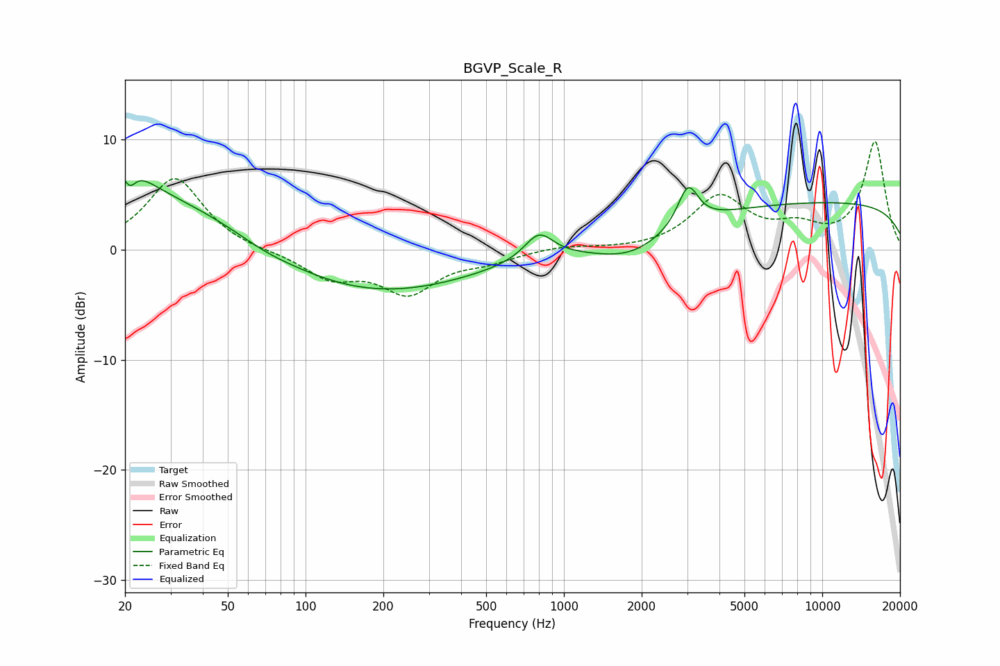

# BGVP_Scale_R
See [usage instructions](https://github.com/jaakkopasanen/AutoEq#usage) for more options and info.

### Parametric EQs
Apply preamp of -6.4 dB when using parametric equalizer.

|   # | Type    |   Fc (Hz) |    Q |   Gain (dB) |
|-----|---------|-----------|------|-------------|
|   1 | Peaking |        20 | 0.28 |         5.8 |
|   2 | Peaking |        20 | 1.84 |         2.4 |
|   3 | Peaking |        21 | 5.97 |        -2.9 |
|   4 | Peaking |        21 | 5.88 |         1.1 |
|   5 | Peaking |        70 | 1.48 |        -0.4 |
|   6 | Peaking |       163 | 0.34 |        -4.4 |
|   7 | Peaking |       800 | 2.53 |         2.4 |
|   8 | Peaking |      1820 | 1.02 |        -2   |
|   9 | Peaking |      3022 | 3.63 |         3.6 |
|  10 | Peaking |     10000 | 0.18 |         4.3 |

### Fixed Band EQs
When using fixed band (also called graphic) equalizer, apply preamp of **-9.9 dB** (if available) and set gains manually with these parameters.

|   # | Type    |   Fc (Hz) |    Q |   Gain (dB) |
|-----|---------|-----------|------|-------------|
|   1 | Peaking |        31 | 1.41 |         6.6 |
|   2 | Peaking |        62 | 1.41 |        -0.2 |
|   3 | Peaking |       125 | 1.41 |        -2.4 |
|   4 | Peaking |       250 | 1.41 |        -3.7 |
|   5 | Peaking |       500 | 1.41 |        -0.9 |
|   6 | Peaking |      1000 | 1.41 |         0.3 |
|   7 | Peaking |      2000 | 1.41 |        -0.1 |
|   8 | Peaking |      4000 | 1.41 |         4.7 |
|   9 | Peaking |      8000 | 1.41 |         1.6 |
|  10 | Peaking |     16000 | 1.41 |         9.8 |

### Graphs

