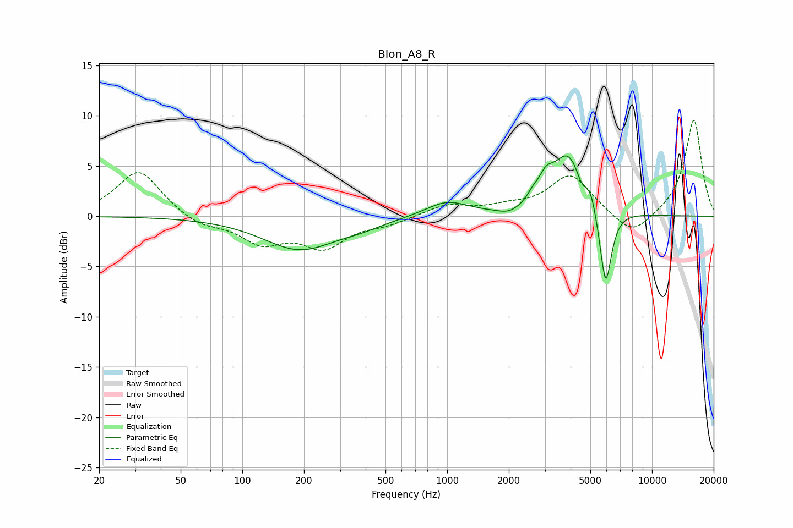

# Blon_A8_R
See [usage instructions](https://github.com/jaakkopasanen/AutoEq#usage) for more options and info.

### Parametric EQs
Apply preamp of -6.1 dB when using parametric equalizer.

|   # | Type    |   Fc (Hz) |    Q |   Gain (dB) |
|-----|---------|-----------|------|-------------|
|   1 | Peaking |       191 | 0.79 |        -3.3 |
|   2 | Peaking |       385 | 1.31 |        -0.5 |
|   3 | Peaking |       996 | 1.35 |         1.5 |
|   4 | Peaking |      2014 | 2.54 |        -0.6 |
|   5 | Peaking |      2617 | 5.85 |         0.6 |
|   6 | Peaking |      3027 | 3.87 |         1.8 |
|   7 | Peaking |      3904 | 1.77 |         6.1 |
|   8 | Peaking |      4510 | 6    |        -0.9 |
|   9 | Peaking |      5032 | 6    |         1.2 |
|  10 | Peaking |      5938 | 4.7  |        -8   |

### Fixed Band EQs
When using fixed band (also called graphic) equalizer, apply preamp of **-9.6 dB** (if available) and set gains manually with these parameters.

|   # | Type    |   Fc (Hz) |    Q |   Gain (dB) |
|-----|---------|-----------|------|-------------|
|   1 | Peaking |        31 | 1.41 |         4.6 |
|   2 | Peaking |        62 | 1.41 |        -1   |
|   3 | Peaking |       125 | 1.41 |        -2.4 |
|   4 | Peaking |       250 | 1.41 |        -2.9 |
|   5 | Peaking |       500 | 1.41 |        -0.7 |
|   6 | Peaking |      1000 | 1.41 |         1.1 |
|   7 | Peaking |      2000 | 1.41 |         0.7 |
|   8 | Peaking |      4000 | 1.41 |         4.1 |
|   9 | Peaking |      8000 | 1.41 |        -2.3 |
|  10 | Peaking |     16000 | 1.41 |         9.7 |

### Graphs

