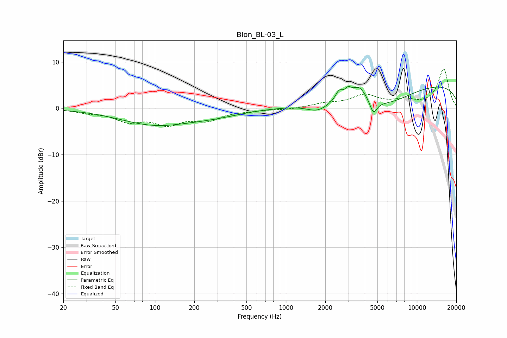

# Blon_BL-03_L
See [usage instructions](https://github.com/jaakkopasanen/AutoEq#usage) for more options and info.

### Parametric EQs
Apply preamp of -4.8 dB when using parametric equalizer.

|   # | Type    |   Fc (Hz) |    Q |   Gain (dB) |
|-----|---------|-----------|------|-------------|
|   1 | Peaking |       100 | 0.52 |        -3.4 |
|   2 | Peaking |       286 | 0.66 |        -1.2 |
|   3 | Peaking |      1038 | 1.93 |        -0   |
|   4 | Peaking |      1755 | 1.64 |        -2   |
|   5 | Peaking |      2544 | 5.21 |         1.9 |
|   6 | Peaking |      2986 | 5.46 |         1.6 |
|   7 | Peaking |      3642 | 2.66 |         3   |
|   8 | Peaking |      4660 | 5.05 |        -2.9 |
|   9 | Peaking |      5815 | 0.67 |        -3.9 |
|  10 | Peaking |     10000 | 0.18 |         5.5 |

### Fixed Band EQs
When using fixed band (also called graphic) equalizer, apply preamp of **-8.5 dB** (if available) and set gains manually with these parameters.

|   # | Type    |   Fc (Hz) |    Q |   Gain (dB) |
|-----|---------|-----------|------|-------------|
|   1 | Peaking |        31 | 1.41 |        -0.7 |
|   2 | Peaking |        62 | 1.41 |        -2.5 |
|   3 | Peaking |       125 | 1.41 |        -3   |
|   4 | Peaking |       250 | 1.41 |        -2.2 |
|   5 | Peaking |       500 | 1.41 |        -0.4 |
|   6 | Peaking |      1000 | 1.41 |        -0.3 |
|   7 | Peaking |      2000 | 1.41 |         0.9 |
|   8 | Peaking |      4000 | 1.41 |         2.6 |
|   9 | Peaking |      8000 | 1.41 |         1.4 |
|  10 | Peaking |     16000 | 1.41 |         8.4 |

### Graphs

