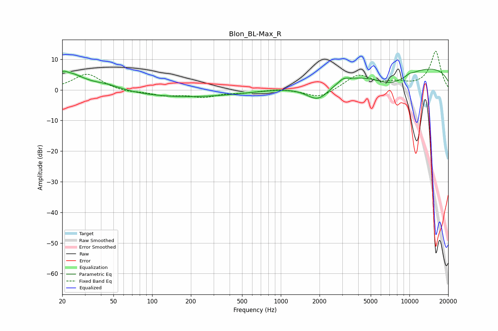

# Blon_BL-Max_R
See [usage instructions](https://github.com/jaakkopasanen/AutoEq#usage) for more options and info.

### Parametric EQs
Apply preamp of -6.8 dB when using parametric equalizer.

|   # | Type    |   Fc (Hz) |    Q |   Gain (dB) |
|-----|---------|-----------|------|-------------|
|   1 | Peaking |        20 | 5.85 |         1.2 |
|   2 | Peaking |        23 | 1.21 |         5.2 |
|   3 | Peaking |        45 | 1.28 |         1.5 |
|   4 | Peaking |       180 | 0.34 |        -2.4 |
|   5 | Peaking |      1935 | 1.48 |        -4.6 |
|   6 | Peaking |      2003 | 1.59 |        -1.3 |
|   7 | Peaking |      3068 | 3.81 |         1.2 |
|   8 | Peaking |      7194 | 0.93 |        -5.3 |
|   9 | Peaking |     10000 | 0.18 |         8.1 |
|  10 | Peaking |     10000 | 6    |         0.4 |

### Fixed Band EQs
When using fixed band (also called graphic) equalizer, apply preamp of **-12.7 dB** (if available) and set gains manually with these parameters.

|   # | Type    |   Fc (Hz) |    Q |   Gain (dB) |
|-----|---------|-----------|------|-------------|
|   1 | Peaking |        31 | 1.41 |         5.3 |
|   2 | Peaking |        62 | 1.41 |        -0.8 |
|   3 | Peaking |       125 | 1.41 |        -1.6 |
|   4 | Peaking |       250 | 1.41 |        -2.1 |
|   5 | Peaking |       500 | 1.41 |        -0.8 |
|   6 | Peaking |      1000 | 1.41 |         0.4 |
|   7 | Peaking |      2000 | 1.41 |        -2.8 |
|   8 | Peaking |      4000 | 1.41 |         4.8 |
|   9 | Peaking |      8000 | 1.41 |         1.7 |
|  10 | Peaking |     16000 | 1.41 |        12.6 |

### Graphs

