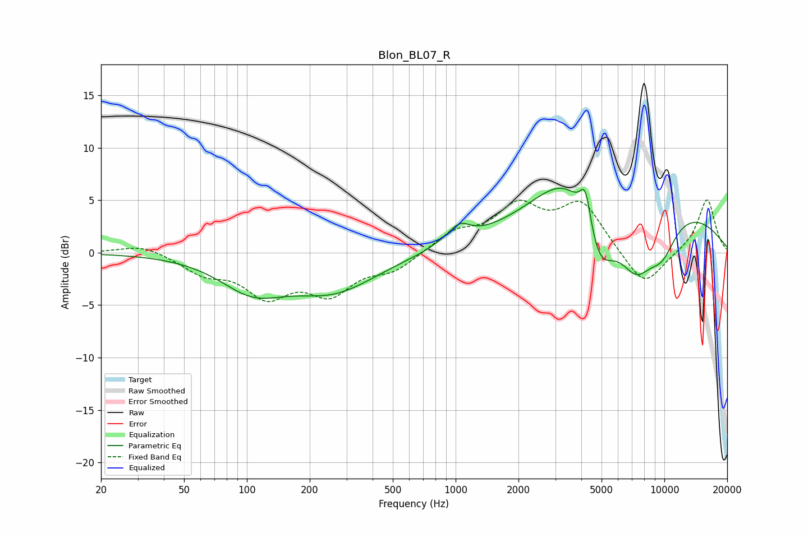

# Blon_BL07_R
See [usage instructions](https://github.com/jaakkopasanen/AutoEq#usage) for more options and info.

### Parametric EQs
Apply preamp of -6.2 dB when using parametric equalizer.

|   # | Type    |   Fc (Hz) |    Q |   Gain (dB) |
|-----|---------|-----------|------|-------------|
|   1 | Peaking |       106 | 0.91 |        -3.1 |
|   2 | Peaking |       261 | 0.68 |        -3.4 |
|   3 | Peaking |       917 | 1.81 |         0.4 |
|   4 | Peaking |      1049 | 2.9  |         1.3 |
|   5 | Peaking |      3536 | 0.94 |         4.6 |
|   6 | Peaking |      4193 | 5.28 |         3.6 |
|   7 | Peaking |      4828 | 1.69 |        -6.9 |
|   8 | Peaking |      7223 | 0.25 |         5.2 |
|   9 | Peaking |      7334 | 1.49 |        -5.4 |
|  10 | Peaking |      9746 | 1.73 |        -3.3 |

### Fixed Band EQs
When using fixed band (also called graphic) equalizer, apply preamp of **-5.1 dB** (if available) and set gains manually with these parameters.

|   # | Type    |   Fc (Hz) |    Q |   Gain (dB) |
|-----|---------|-----------|------|-------------|
|   1 | Peaking |        31 | 1.41 |         0.8 |
|   2 | Peaking |        62 | 1.41 |        -1.7 |
|   3 | Peaking |       125 | 1.41 |        -3.7 |
|   4 | Peaking |       250 | 1.41 |        -3.5 |
|   5 | Peaking |       500 | 1.41 |        -1.5 |
|   6 | Peaking |      1000 | 1.41 |         1.8 |
|   7 | Peaking |      2000 | 1.41 |         4   |
|   8 | Peaking |      4000 | 1.41 |         4.5 |
|   9 | Peaking |      8000 | 1.41 |        -3.5 |
|  10 | Peaking |     16000 | 1.41 |         5.2 |

### Graphs

