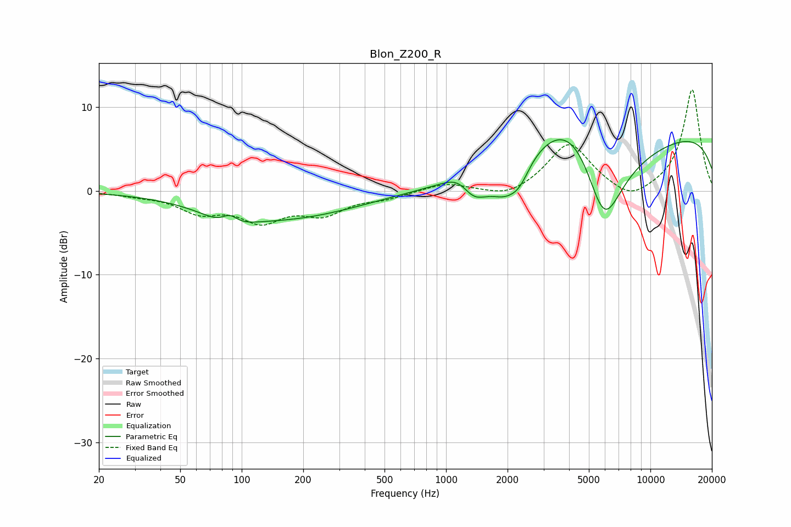

# Blon_Z200_R
See [usage instructions](https://github.com/jaakkopasanen/AutoEq#usage) for more options and info.

### Parametric EQs
Apply preamp of -6.2 dB when using parametric equalizer.

|   # | Type    |   Fc (Hz) |    Q |   Gain (dB) |
|-----|---------|-----------|------|-------------|
|   1 | Peaking |        86 | 1.57 |        -2   |
|   2 | Peaking |        87 | 3.39 |         1.6 |
|   3 | Peaking |       158 | 0.39 |        -3.3 |
|   4 | Peaking |      1198 | 1.92 |         2.6 |
|   5 | Peaking |      1339 | 1.95 |        -3.9 |
|   6 | Peaking |      1977 | 1.59 |        -4.2 |
|   7 | Peaking |      2305 | 2.98 |        -1.6 |
|   8 | Peaking |      4383 | 0.61 |        11.5 |
|   9 | Peaking |      5911 | 0.89 |       -18.7 |
|  10 | Peaking |     10000 | 0.18 |         7.8 |

### Fixed Band EQs
When using fixed band (also called graphic) equalizer, apply preamp of **-12.1 dB** (if available) and set gains manually with these parameters.

|   # | Type    |   Fc (Hz) |    Q |   Gain (dB) |
|-----|---------|-----------|------|-------------|
|   1 | Peaking |        31 | 1.41 |        -0.4 |
|   2 | Peaking |        62 | 1.41 |        -2.3 |
|   3 | Peaking |       125 | 1.41 |        -3.2 |
|   4 | Peaking |       250 | 1.41 |        -2.4 |
|   5 | Peaking |       500 | 1.41 |        -0.7 |
|   6 | Peaking |      1000 | 1.41 |         1   |
|   7 | Peaking |      2000 | 1.41 |        -1   |
|   8 | Peaking |      4000 | 1.41 |         5.7 |
|   9 | Peaking |      8000 | 1.41 |        -1.6 |
|  10 | Peaking |     16000 | 1.41 |        12.1 |

### Graphs

