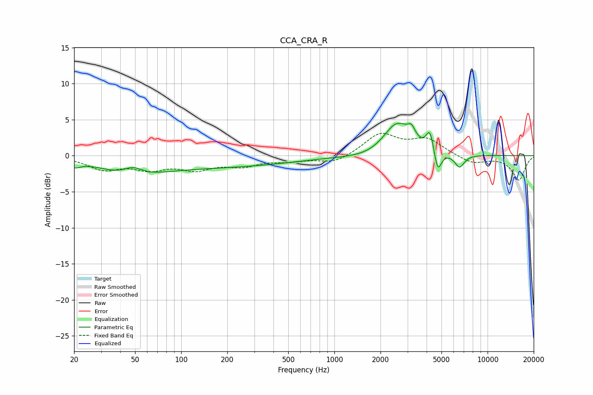

# CCA_CRA_R
See [usage instructions](https://github.com/jaakkopasanen/AutoEq#usage) for more options and info.

### Parametric EQs
Apply preamp of -4.6 dB when using parametric equalizer.

|   # | Type    |   Fc (Hz) |    Q |   Gain (dB) |
|-----|---------|-----------|------|-------------|
|   1 | Peaking |        20 | 3.48 |        -0.8 |
|   2 | Peaking |        47 | 0.87 |        -2.1 |
|   3 | Peaking |        49 | 2.05 |         1.6 |
|   4 | Peaking |       147 | 0.25 |        -1.6 |
|   5 | Peaking |      1818 | 0.96 |        -0.6 |
|   6 | Peaking |      2561 | 1.54 |         4.8 |
|   7 | Peaking |      3185 | 5.72 |         1.4 |
|   8 | Peaking |      4207 | 5.99 |         2.9 |
|   9 | Peaking |      4731 | 6    |        -3.1 |
|  10 | Peaking |      6559 | 4.38 |        -1.8 |

### Fixed Band EQs
When using fixed band (also called graphic) equalizer, apply preamp of **-3.2 dB** (if available) and set gains manually with these parameters.

|   # | Type    |   Fc (Hz) |    Q |   Gain (dB) |
|-----|---------|-----------|------|-------------|
|   1 | Peaking |        31 | 1.41 |        -1.7 |
|   2 | Peaking |        62 | 1.41 |        -1.6 |
|   3 | Peaking |       125 | 1.41 |        -1.6 |
|   4 | Peaking |       250 | 1.41 |        -1.2 |
|   5 | Peaking |       500 | 1.41 |        -0.6 |
|   6 | Peaking |      1000 | 1.41 |        -1.1 |
|   7 | Peaking |      2000 | 1.41 |         3   |
|   8 | Peaking |      4000 | 1.41 |         2.2 |
|   9 | Peaking |      8000 | 1.41 |        -1.1 |
|  10 | Peaking |     16000 | 1.41 |        -3.4 |

### Graphs

