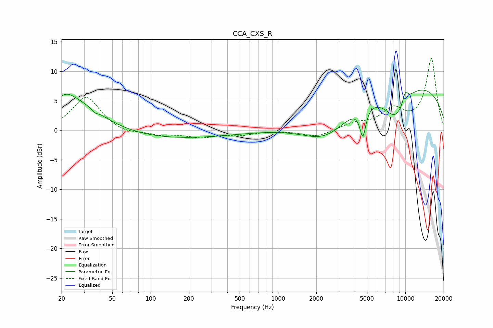

# CCA_CXS_R
See [usage instructions](https://github.com/jaakkopasanen/AutoEq#usage) for more options and info.

### Parametric EQs
Apply preamp of -6.9 dB when using parametric equalizer.

|   # | Type    |   Fc (Hz) |    Q |   Gain (dB) |
|-----|---------|-----------|------|-------------|
|   1 | Peaking |        21 | 1.92 |         1.8 |
|   2 | Peaking |        25 | 0.62 |         5.6 |
|   3 | Peaking |        37 | 5.76 |        -1.7 |
|   4 | Peaking |        37 | 5.36 |         1.3 |
|   5 | Peaking |        81 | 0.19 |        -1.7 |
|   6 | Peaking |      2429 | 0.7  |        -5.5 |
|   7 | Peaking |      4637 | 6    |        -4.8 |
|   8 | Peaking |      8341 | 1.4  |        -5.2 |
|   9 | Peaking |      8917 | 0.2  |         8.6 |
|  10 | Peaking |     10000 | 6    |         1.9 |

### Fixed Band EQs
When using fixed band (also called graphic) equalizer, apply preamp of **-12.3 dB** (if available) and set gains manually with these parameters.

|   # | Type    |   Fc (Hz) |    Q |   Gain (dB) |
|-----|---------|-----------|------|-------------|
|   1 | Peaking |        31 | 1.41 |         5.7 |
|   2 | Peaking |        62 | 1.41 |        -0.7 |
|   3 | Peaking |       125 | 1.41 |        -0.8 |
|   4 | Peaking |       250 | 1.41 |        -1   |
|   5 | Peaking |       500 | 1.41 |        -0.7 |
|   6 | Peaking |      1000 | 1.41 |        -0   |
|   7 | Peaking |      2000 | 1.41 |        -1.1 |
|   8 | Peaking |      4000 | 1.41 |         1.1 |
|   9 | Peaking |      8000 | 1.41 |         3.2 |
|  10 | Peaking |     16000 | 1.41 |        12.1 |

### Graphs

