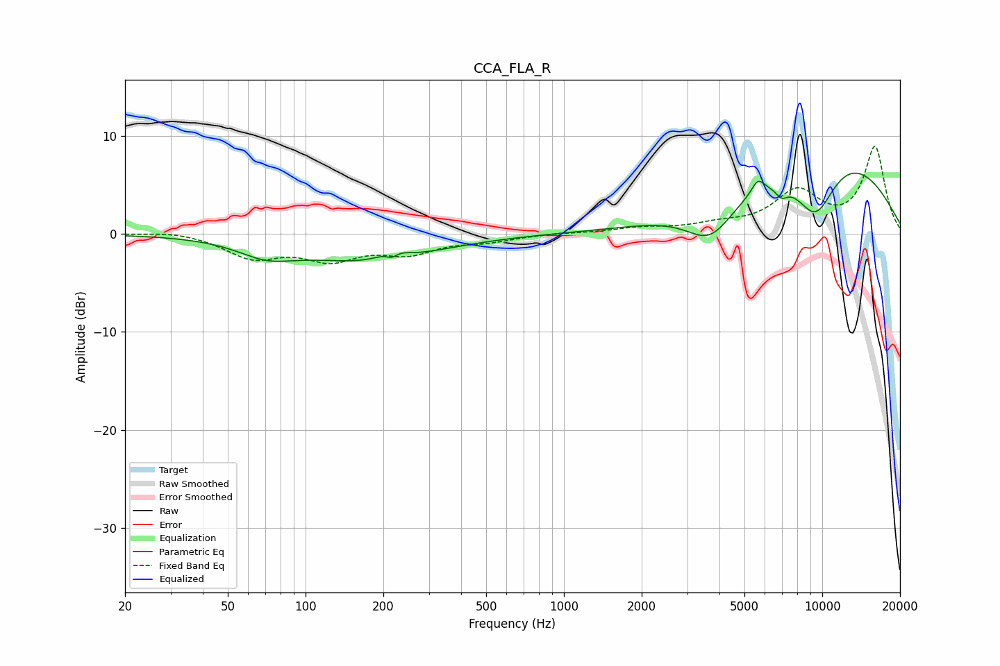

# CCA_FLA_R
See [usage instructions](https://github.com/jaakkopasanen/AutoEq#usage) for more options and info.

### Parametric EQs
Apply preamp of -6.3 dB when using parametric equalizer.

|   # | Type    |   Fc (Hz) |    Q |   Gain (dB) |
|-----|---------|-----------|------|-------------|
|   1 | Peaking |        71 | 1.28 |        -1.6 |
|   2 | Peaking |       177 | 0.56 |        -2.7 |
|   3 | Peaking |       206 | 3.32 |         0.2 |
|   4 | Peaking |       216 | 5.93 |        -0.9 |
|   5 | Peaking |       220 | 3.01 |         0.9 |
|   6 | Peaking |      3686 | 1.51 |        -3.9 |
|   7 | Peaking |      5637 | 5.49 |         1.4 |
|   8 | Peaking |      6956 | 5.71 |        -1.1 |
|   9 | Peaking |      9410 | 1.49 |        -6.5 |
|  10 | Peaking |     10000 | 0.37 |         9.1 |

### Fixed Band EQs
When using fixed band (also called graphic) equalizer, apply preamp of **-9.0 dB** (if available) and set gains manually with these parameters.

|   # | Type    |   Fc (Hz) |    Q |   Gain (dB) |
|-----|---------|-----------|------|-------------|
|   1 | Peaking |        31 | 1.41 |         0.4 |
|   2 | Peaking |        62 | 1.41 |        -2.3 |
|   3 | Peaking |       125 | 1.41 |        -2.3 |
|   4 | Peaking |       250 | 1.41 |        -1.7 |
|   5 | Peaking |       500 | 1.41 |        -0.6 |
|   6 | Peaking |      1000 | 1.41 |         0.1 |
|   7 | Peaking |      2000 | 1.41 |         0.5 |
|   8 | Peaking |      4000 | 1.41 |         0.7 |
|   9 | Peaking |      8000 | 1.41 |         4.1 |
|  10 | Peaking |     16000 | 1.41 |         8.8 |

### Graphs

