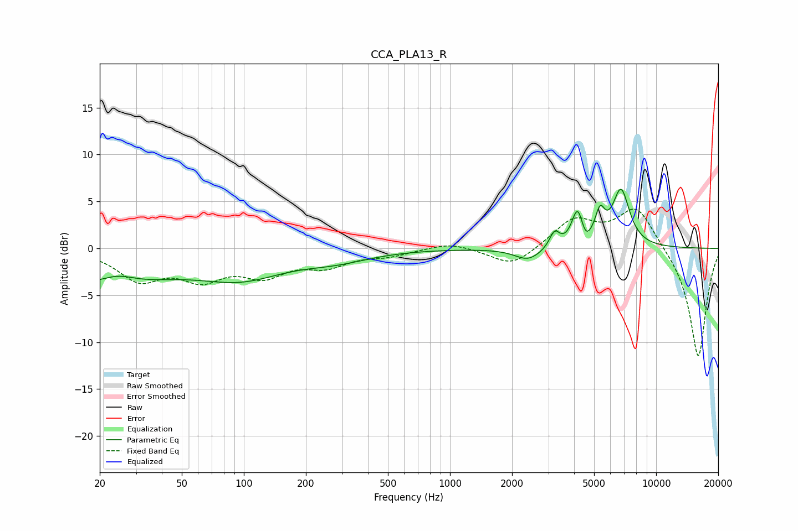

# CCA_PLA13_R
See [usage instructions](https://github.com/jaakkopasanen/AutoEq#usage) for more options and info.

### Parametric EQs
Apply preamp of -6.4 dB when using parametric equalizer.

|   # | Type    |   Fc (Hz) |    Q |   Gain (dB) |
|-----|---------|-----------|------|-------------|
|   1 | Peaking |        20 | 0.45 |        -3.9 |
|   2 | Peaking |        24 | 1.61 |         1.2 |
|   3 | Peaking |        97 | 0.68 |        -2.7 |
|   4 | Peaking |       279 | 0.82 |        -1   |
|   5 | Peaking |      2395 | 2.21 |        -1.3 |
|   6 | Peaking |      3214 | 5.94 |         1.7 |
|   7 | Peaking |      4154 | 5.12 |         3.8 |
|   8 | Peaking |      4549 | 6    |        -1.1 |
|   9 | Peaking |      5344 | 5.85 |         2.9 |
|  10 | Peaking |      6753 | 3.25 |         6   |

### Fixed Band EQs
When using fixed band (also called graphic) equalizer, apply preamp of **-4.3 dB** (if available) and set gains manually with these parameters.

|   # | Type    |   Fc (Hz) |    Q |   Gain (dB) |
|-----|---------|-----------|------|-------------|
|   1 | Peaking |        31 | 1.41 |        -3.1 |
|   2 | Peaking |        62 | 1.41 |        -2.8 |
|   3 | Peaking |       125 | 1.41 |        -2.5 |
|   4 | Peaking |       250 | 1.41 |        -1.6 |
|   5 | Peaking |       500 | 1.41 |        -0.7 |
|   6 | Peaking |      1000 | 1.41 |         0.7 |
|   7 | Peaking |      2000 | 1.41 |        -2   |
|   8 | Peaking |      4000 | 1.41 |         3   |
|   9 | Peaking |      8000 | 1.41 |         4.5 |
|  10 | Peaking |     16000 | 1.41 |       -11.8 |

### Graphs

