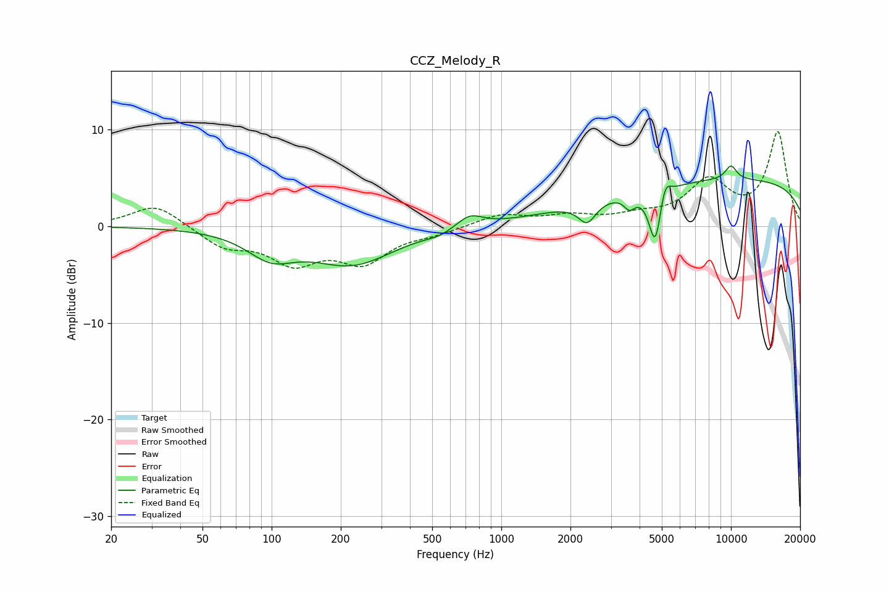

# CCZ_Melody_R
See [usage instructions](https://github.com/jaakkopasanen/AutoEq#usage) for more options and info.

### Parametric EQs
Apply preamp of -6.4 dB when using parametric equalizer.

|   # | Type    |   Fc (Hz) |    Q |   Gain (dB) |
|-----|---------|-----------|------|-------------|
|   1 | Peaking |        99 | 1.37 |        -2.5 |
|   2 | Peaking |       224 | 0.77 |        -3.8 |
|   3 | Peaking |       534 | 2.63 |        -0.4 |
|   4 | Peaking |       729 | 2.53 |         1.3 |
|   5 | Peaking |      2365 | 3.7  |        -2.1 |
|   6 | Peaking |      3617 | 5.95 |        -1.3 |
|   7 | Peaking |      4681 | 5.06 |        -5.9 |
|   8 | Peaking |      5152 | 6    |         2.1 |
|   9 | Peaking |     10000 | 0.18 |         4.8 |
|  10 | Peaking |     10000 | 4.84 |         1.5 |

### Fixed Band EQs
When using fixed band (also called graphic) equalizer, apply preamp of **-9.9 dB** (if available) and set gains manually with these parameters.

|   # | Type    |   Fc (Hz) |    Q |   Gain (dB) |
|-----|---------|-----------|------|-------------|
|   1 | Peaking |        31 | 1.41 |         2.4 |
|   2 | Peaking |        62 | 1.41 |        -2   |
|   3 | Peaking |       125 | 1.41 |        -3.4 |
|   4 | Peaking |       250 | 1.41 |        -3.4 |
|   5 | Peaking |       500 | 1.41 |        -0.6 |
|   6 | Peaking |      1000 | 1.41 |         1.2 |
|   7 | Peaking |      2000 | 1.41 |         0.9 |
|   8 | Peaking |      4000 | 1.41 |         0.8 |
|   9 | Peaking |      8000 | 1.41 |         4.4 |
|  10 | Peaking |     16000 | 1.41 |         9.6 |

### Graphs

