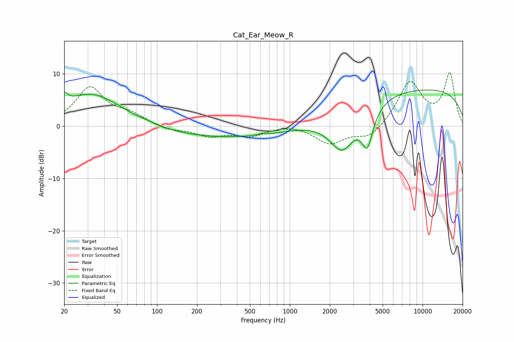

# Cat_Ear_Meow_R
See [usage instructions](https://github.com/jaakkopasanen/AutoEq#usage) for more options and info.

### Parametric EQs
Apply preamp of -7.0 dB when using parametric equalizer.

|   # | Type    |   Fc (Hz) |    Q |   Gain (dB) |
|-----|---------|-----------|------|-------------|
|   1 | Peaking |        20 | 5.76 |         2   |
|   2 | Peaking |        32 | 0.61 |         6.3 |
|   3 | Peaking |        77 | 1.58 |        -1.1 |
|   4 | Peaking |        79 | 1.62 |         1.3 |
|   5 | Peaking |       331 | 0.24 |        -2.3 |
|   6 | Peaking |       625 | 5.97 |         0.3 |
|   7 | Peaking |      2476 | 1.37 |        -8.1 |
|   8 | Peaking |      3837 | 3.25 |        -7   |
|   9 | Peaking |      8953 | 0.18 |         4.6 |
|  10 | Peaking |      8963 | 0.18 |         2.6 |

### Fixed Band EQs
When using fixed band (also called graphic) equalizer, apply preamp of **-10.3 dB** (if available) and set gains manually with these parameters.

|   # | Type    |   Fc (Hz) |    Q |   Gain (dB) |
|-----|---------|-----------|------|-------------|
|   1 | Peaking |        31 | 1.41 |         7.2 |
|   2 | Peaking |        62 | 1.41 |         1.8 |
|   3 | Peaking |       125 | 1.41 |        -0.8 |
|   4 | Peaking |       250 | 1.41 |        -1.8 |
|   5 | Peaking |       500 | 1.41 |        -1.7 |
|   6 | Peaking |      1000 | 1.41 |         0.4 |
|   7 | Peaking |      2000 | 1.41 |        -3.3 |
|   8 | Peaking |      4000 | 1.41 |        -2.5 |
|   9 | Peaking |      8000 | 1.41 |         8.4 |
|  10 | Peaking |     16000 | 1.41 |         9.9 |

### Graphs

