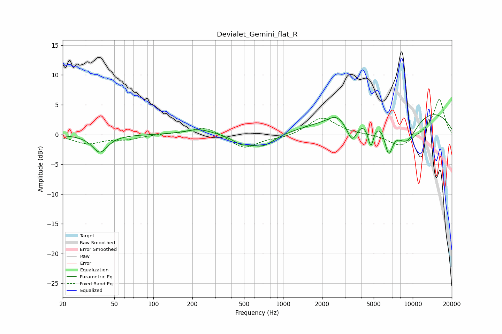

# Devialet_Gemini_flat_R
See [usage instructions](https://github.com/jaakkopasanen/AutoEq#usage) for more options and info.

### Parametric EQs
Apply preamp of -3.4 dB when using parametric equalizer.

|   # | Type    |   Fc (Hz) |    Q |   Gain (dB) |
|-----|---------|-----------|------|-------------|
|   1 | Peaking |        39 | 2.46 |        -3   |
|   2 | Peaking |       224 | 1.36 |         0.9 |
|   3 | Peaking |       473 | 2.17 |        -1.2 |
|   4 | Peaking |       696 | 1.54 |        -2.1 |
|   5 | Peaking |      2540 | 2.69 |         0.9 |
|   6 | Peaking |      3411 | 3.41 |        -3.9 |
|   7 | Peaking |      4750 | 6    |        -4.2 |
|   8 | Peaking |      6522 | 4.19 |        -5.1 |
|   9 | Peaking |      8588 | 0.22 |         5   |
|  10 | Peaking |      8889 | 1.35 |        -5.5 |

### Fixed Band EQs
When using fixed band (also called graphic) equalizer, apply preamp of **-6.0 dB** (if available) and set gains manually with these parameters.

|   # | Type    |   Fc (Hz) |    Q |   Gain (dB) |
|-----|---------|-----------|------|-------------|
|   1 | Peaking |        31 | 1.41 |        -1.5 |
|   2 | Peaking |        62 | 1.41 |        -0.7 |
|   3 | Peaking |       125 | 1.41 |         0.1 |
|   4 | Peaking |       250 | 1.41 |         1.4 |
|   5 | Peaking |       500 | 1.41 |        -2.4 |
|   6 | Peaking |      1000 | 1.41 |        -0.5 |
|   7 | Peaking |      2000 | 1.41 |         2.9 |
|   8 | Peaking |      4000 | 1.41 |         0   |
|   9 | Peaking |      8000 | 1.41 |        -2.1 |
|  10 | Peaking |     16000 | 1.41 |         6   |

### Graphs

