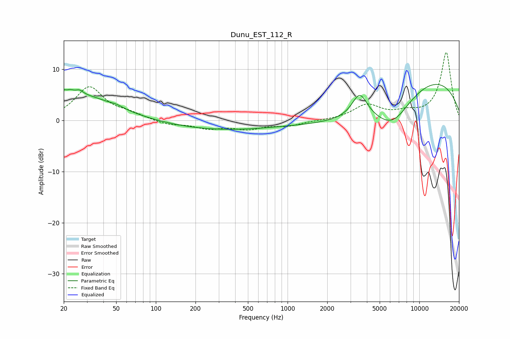

# Dunu_EST_112_R
See [usage instructions](https://github.com/jaakkopasanen/AutoEq#usage) for more options and info.

### Parametric EQs
Apply preamp of -7.1 dB when using parametric equalizer.

|   # | Type    |   Fc (Hz) |    Q |   Gain (dB) |
|-----|---------|-----------|------|-------------|
|   1 | Peaking |        21 | 3.96 |         3.9 |
|   2 | Peaking |        21 | 5.77 |        -2.2 |
|   3 | Peaking |        26 | 5.32 |         0.8 |
|   4 | Peaking |        28 | 0.56 |         4.7 |
|   5 | Peaking |        51 | 3.23 |         0.3 |
|   6 | Peaking |       311 | 0.34 |        -1.8 |
|   7 | Peaking |      3527 | 2.43 |         4.8 |
|   8 | Peaking |      4907 | 0.32 |        -5.4 |
|   9 | Peaking |      6271 | 0.99 |        -5.6 |
|  10 | Peaking |      9257 | 0.27 |        11.6 |

### Fixed Band EQs
When using fixed band (also called graphic) equalizer, apply preamp of **-13.4 dB** (if available) and set gains manually with these parameters.

|   # | Type    |   Fc (Hz) |    Q |   Gain (dB) |
|-----|---------|-----------|------|-------------|
|   1 | Peaking |        31 | 1.41 |         6.4 |
|   2 | Peaking |        62 | 1.41 |         1   |
|   3 | Peaking |       125 | 1.41 |        -0.8 |
|   4 | Peaking |       250 | 1.41 |        -1.4 |
|   5 | Peaking |       500 | 1.41 |        -1.5 |
|   6 | Peaking |      1000 | 1.41 |        -1   |
|   7 | Peaking |      2000 | 1.41 |        -0   |
|   8 | Peaking |      4000 | 1.41 |         2.9 |
|   9 | Peaking |      8000 | 1.41 |         1.2 |
|  10 | Peaking |     16000 | 1.41 |        13.3 |

### Graphs

