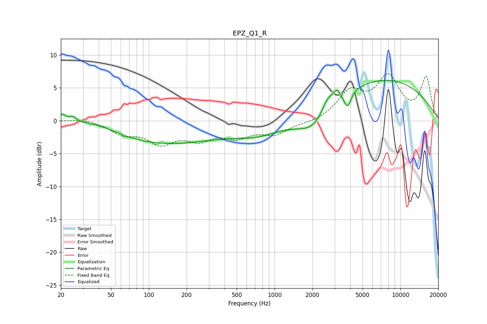

# EPZ_Q1_R
See [usage instructions](https://github.com/jaakkopasanen/AutoEq#usage) for more options and info.

### Parametric EQs
Apply preamp of -6.2 dB when using parametric equalizer.

|   # | Type    |   Fc (Hz) |    Q |   Gain (dB) |
|-----|---------|-----------|------|-------------|
|   1 | Peaking |        21 | 5.93 |         1.1 |
|   2 | Peaking |        25 | 5.7  |         0.8 |
|   3 | Peaking |        38 | 0.81 |         1.2 |
|   4 | Peaking |       126 | 0.31 |        -3.5 |
|   5 | Peaking |       748 | 0.74 |        -1.8 |
|   6 | Peaking |      2058 | 1.04 |        -3.7 |
|   7 | Peaking |      2671 | 2.75 |         2.3 |
|   8 | Peaking |      3138 | 5.9  |         1.3 |
|   9 | Peaking |      3803 | 5.36 |        -2.3 |
|  10 | Peaking |      7007 | 0.29 |         6.4 |

### Fixed Band EQs
When using fixed band (also called graphic) equalizer, apply preamp of **-7.3 dB** (if available) and set gains manually with these parameters.

|   # | Type    |   Fc (Hz) |    Q |   Gain (dB) |
|-----|---------|-----------|------|-------------|
|   1 | Peaking |        31 | 1.41 |         0.4 |
|   2 | Peaking |        62 | 1.41 |        -1.8 |
|   3 | Peaking |       125 | 1.41 |        -3   |
|   4 | Peaking |       250 | 1.41 |        -2.4 |
|   5 | Peaking |       500 | 1.41 |        -2.1 |
|   6 | Peaking |      1000 | 1.41 |        -1.9 |
|   7 | Peaking |      2000 | 1.41 |        -0.4 |
|   8 | Peaking |      4000 | 1.41 |         4.1 |
|   9 | Peaking |      8000 | 1.41 |         6.3 |
|  10 | Peaking |     16000 | 1.41 |         6.4 |

### Graphs

