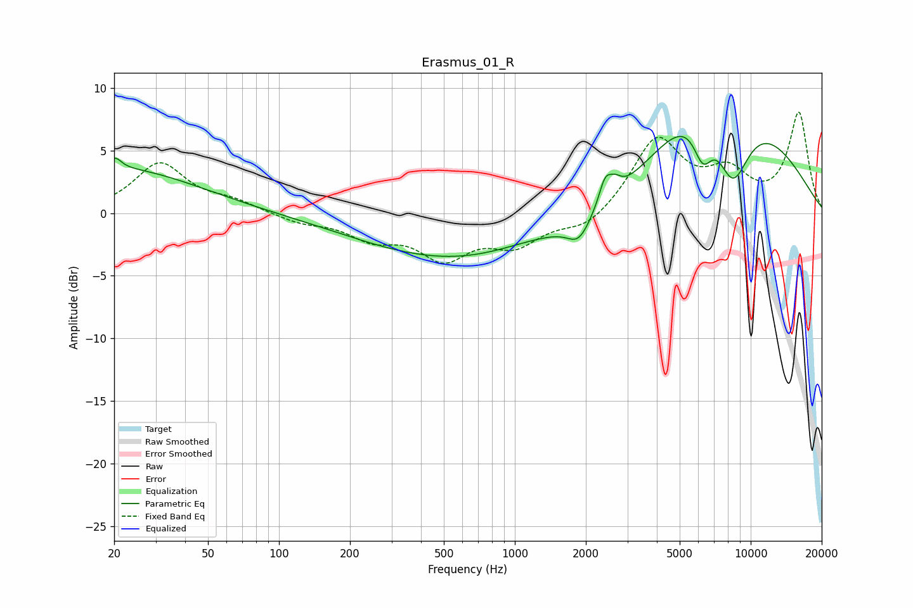

# Erasmus_01_R
See [usage instructions](https://github.com/jaakkopasanen/AutoEq#usage) for more options and info.

### Parametric EQs
Apply preamp of -6.2 dB when using parametric equalizer.

|   # | Type    |   Fc (Hz) |    Q |   Gain (dB) |
|-----|---------|-----------|------|-------------|
|   1 | Peaking |        20 | 5.69 |         0.9 |
|   2 | Peaking |        20 | 0.42 |         3.6 |
|   3 | Peaking |      1126 | 0.2  |        -4.7 |
|   4 | Peaking |      1147 | 0.76 |         1   |
|   5 | Peaking |      1866 | 2.94 |        -1.7 |
|   6 | Peaking |      2415 | 5.32 |         2   |
|   7 | Peaking |      2667 | 5.34 |         0.8 |
|   8 | Peaking |      6274 | 3.12 |        -3.7 |
|   9 | Peaking |      7089 | 0.49 |        14.2 |
|  10 | Peaking |      8342 | 1.52 |        -8.7 |

### Fixed Band EQs
When using fixed band (also called graphic) equalizer, apply preamp of **-8.2 dB** (if available) and set gains manually with these parameters.

|   # | Type    |   Fc (Hz) |    Q |   Gain (dB) |
|-----|---------|-----------|------|-------------|
|   1 | Peaking |        31 | 1.41 |         3.9 |
|   2 | Peaking |        62 | 1.41 |         0.8 |
|   3 | Peaking |       125 | 1.41 |        -0.7 |
|   4 | Peaking |       250 | 1.41 |        -1.8 |
|   5 | Peaking |       500 | 1.41 |        -3.3 |
|   6 | Peaking |      1000 | 1.41 |        -2.3 |
|   7 | Peaking |      2000 | 1.41 |        -1.3 |
|   8 | Peaking |      4000 | 1.41 |         5.9 |
|   9 | Peaking |      8000 | 1.41 |         2.8 |
|  10 | Peaking |     16000 | 1.41 |         7.9 |

### Graphs

