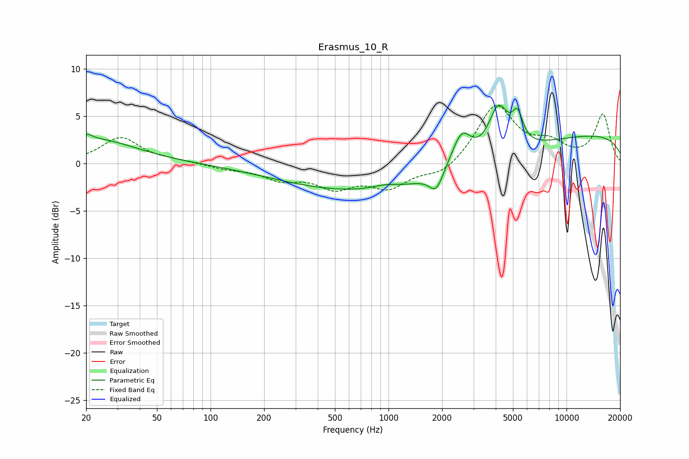

# Erasmus_10_R
See [usage instructions](https://github.com/jaakkopasanen/AutoEq#usage) for more options and info.

### Parametric EQs
Apply preamp of -6.2 dB when using parametric equalizer.

|   # | Type    |   Fc (Hz) |    Q |   Gain (dB) |
|-----|---------|-----------|------|-------------|
|   1 | Peaking |        20 | 5.29 |         0.6 |
|   2 | Peaking |        22 | 0.61 |         2.5 |
|   3 | Peaking |       954 | 1.84 |         0.5 |
|   4 | Peaking |      1240 | 0.18 |        -3.4 |
|   5 | Peaking |      1838 | 3.9  |        -1.8 |
|   6 | Peaking |      1945 | 5.91 |        -0.2 |
|   7 | Peaking |      2571 | 2.57 |         3.7 |
|   8 | Peaking |      4144 | 2.5  |         5.1 |
|   9 | Peaking |      5304 | 4.72 |         2.9 |
|  10 | Peaking |     10000 | 0.18 |         3.3 |

### Fixed Band EQs
When using fixed band (also called graphic) equalizer, apply preamp of **-6.2 dB** (if available) and set gains manually with these parameters.

|   # | Type    |   Fc (Hz) |    Q |   Gain (dB) |
|-----|---------|-----------|------|-------------|
|   1 | Peaking |        31 | 1.41 |         2.7 |
|   2 | Peaking |        62 | 1.41 |         0.2 |
|   3 | Peaking |       125 | 1.41 |        -0.5 |
|   4 | Peaking |       250 | 1.41 |        -1.5 |
|   5 | Peaking |       500 | 1.41 |        -2.2 |
|   6 | Peaking |      1000 | 1.41 |        -2.3 |
|   7 | Peaking |      2000 | 1.41 |        -1.3 |
|   8 | Peaking |      4000 | 1.41 |         6.1 |
|   9 | Peaking |      8000 | 1.41 |         1.8 |
|  10 | Peaking |     16000 | 1.41 |         5.1 |

### Graphs

