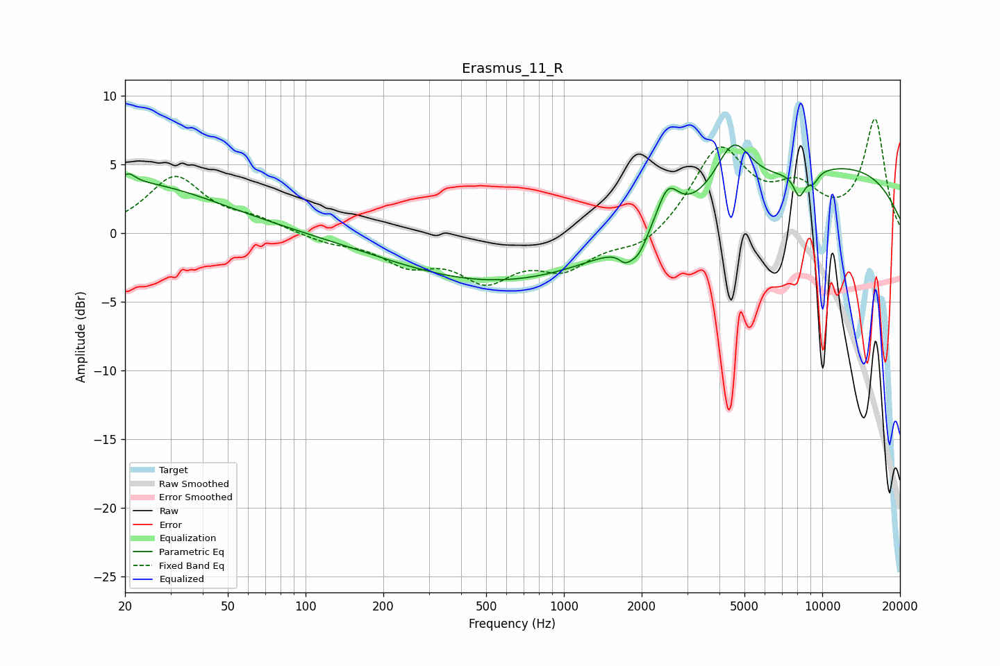

# Erasmus_11_R
See [usage instructions](https://github.com/jaakkopasanen/AutoEq#usage) for more options and info.

### Parametric EQs
Apply preamp of -6.5 dB when using parametric equalizer.

|   # | Type    |   Fc (Hz) |    Q |   Gain (dB) |
|-----|---------|-----------|------|-------------|
|   1 | Peaking |        20 | 0.41 |         3.7 |
|   2 | Peaking |        21 | 5.86 |         0.6 |
|   3 | Peaking |      1199 | 0.18 |        -4.6 |
|   4 | Peaking |      1721 | 5.93 |        -0.7 |
|   5 | Peaking |      1932 | 3.61 |        -1.6 |
|   6 | Peaking |      2521 | 3.31 |         2.7 |
|   7 | Peaking |      4522 | 2.01 |         4   |
|   8 | Peaking |      7258 | 0.18 |         5.8 |
|   9 | Peaking |      8149 | 5.83 |        -1.7 |
|  10 | Peaking |      9228 | 5.91 |        -0.8 |

### Fixed Band EQs
When using fixed band (also called graphic) equalizer, apply preamp of **-8.4 dB** (if available) and set gains manually with these parameters.

|   # | Type    |   Fc (Hz) |    Q |   Gain (dB) |
|-----|---------|-----------|------|-------------|
|   1 | Peaking |        31 | 1.41 |         4   |
|   2 | Peaking |        62 | 1.41 |         0.8 |
|   3 | Peaking |       125 | 1.41 |        -0.6 |
|   4 | Peaking |       250 | 1.41 |        -2   |
|   5 | Peaking |       500 | 1.41 |        -3   |
|   6 | Peaking |      1000 | 1.41 |        -2.3 |
|   7 | Peaking |      2000 | 1.41 |        -1.3 |
|   8 | Peaking |      4000 | 1.41 |         6.1 |
|   9 | Peaking |      8000 | 1.41 |         2.7 |
|  10 | Peaking |     16000 | 1.41 |         8.2 |

### Graphs

