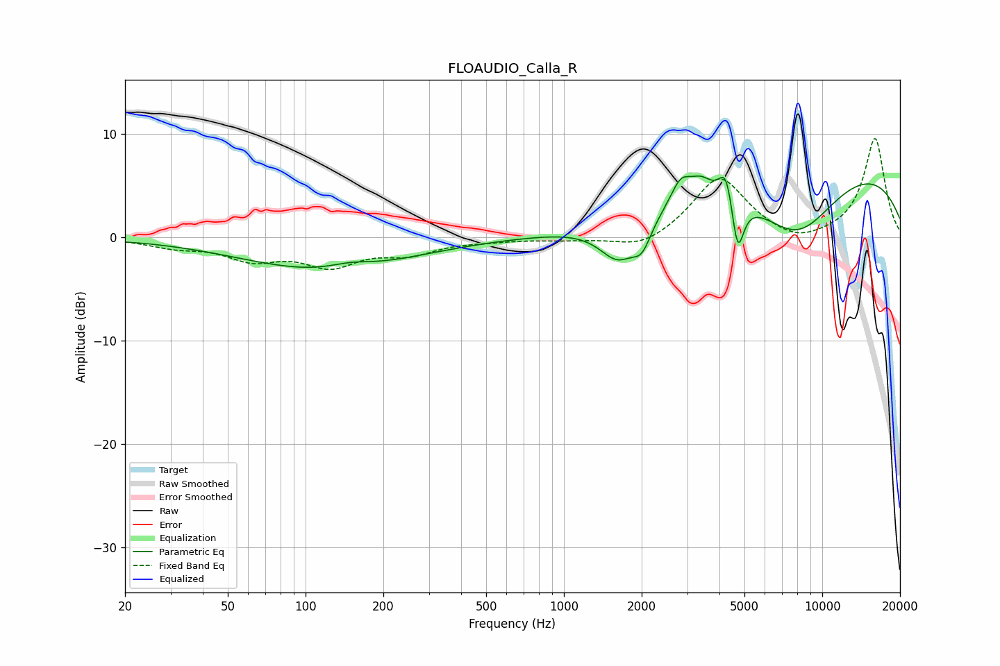

# FLOAUDIO_Calla_R
See [usage instructions](https://github.com/jaakkopasanen/AutoEq#usage) for more options and info.

### Parametric EQs
Apply preamp of -6.0 dB when using parametric equalizer.

|   # | Type    |   Fc (Hz) |    Q |   Gain (dB) |
|-----|---------|-----------|------|-------------|
|   1 | Peaking |       119 | 0.44 |        -3.2 |
|   2 | Peaking |       149 | 1.72 |         0.6 |
|   3 | Peaking |      1627 | 1.89 |        -3.9 |
|   4 | Peaking |      2006 | 3.94 |        -2.3 |
|   5 | Peaking |      2830 | 3.66 |         2.3 |
|   6 | Peaking |      3390 | 3.15 |         1.7 |
|   7 | Peaking |      4248 | 5.13 |         3.4 |
|   8 | Peaking |      4704 | 6    |        -5.4 |
|   9 | Peaking |      7980 | 0.79 |        -7   |
|  10 | Peaking |      9428 | 0.22 |         7.9 |

### Fixed Band EQs
When using fixed band (also called graphic) equalizer, apply preamp of **-9.7 dB** (if available) and set gains manually with these parameters.

|   # | Type    |   Fc (Hz) |    Q |   Gain (dB) |
|-----|---------|-----------|------|-------------|
|   1 | Peaking |        31 | 1.41 |        -0.8 |
|   2 | Peaking |        62 | 1.41 |        -1.9 |
|   3 | Peaking |       125 | 1.41 |        -2.5 |
|   4 | Peaking |       250 | 1.41 |        -1.4 |
|   5 | Peaking |       500 | 1.41 |        -0.2 |
|   6 | Peaking |      1000 | 1.41 |        -0.2 |
|   7 | Peaking |      2000 | 1.41 |        -1.3 |
|   8 | Peaking |      4000 | 1.41 |         5.9 |
|   9 | Peaking |      8000 | 1.41 |        -0.9 |
|  10 | Peaking |     16000 | 1.41 |         9.6 |

### Graphs

