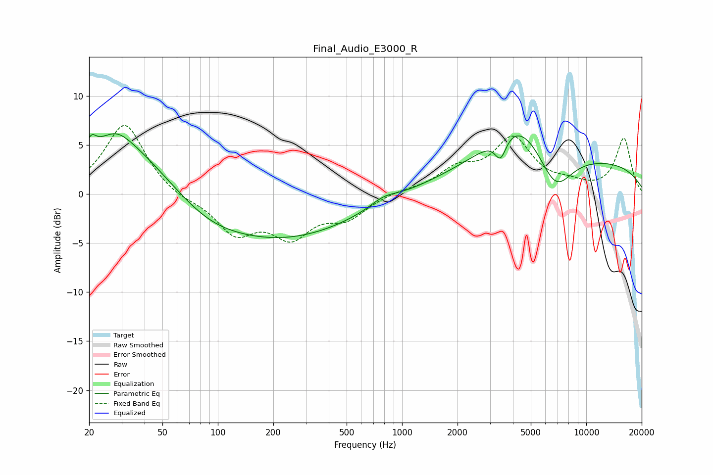

# Final_Audio_E3000_R
See [usage instructions](https://github.com/jaakkopasanen/AutoEq#usage) for more options and info.

### Parametric EQs
Apply preamp of -6.2 dB when using parametric equalizer.

|   # | Type    |   Fc (Hz) |    Q |   Gain (dB) |
|-----|---------|-----------|------|-------------|
|   1 | Peaking |        21 | 5.7  |         1.3 |
|   2 | Peaking |        28 | 1.86 |         1.2 |
|   3 | Peaking |        30 | 0.58 |         5.7 |
|   4 | Peaking |        87 | 0.86 |        -1.1 |
|   5 | Peaking |       210 | 0.33 |        -4.6 |
|   6 | Peaking |       793 | 1.93 |         0.8 |
|   7 | Peaking |      3427 | 4.51 |        -2.3 |
|   8 | Peaking |      4237 | 0.91 |         4.5 |
|   9 | Peaking |      6791 | 1.48 |        -4.2 |
|  10 | Peaking |      7847 | 0.18 |         3.5 |

### Fixed Band EQs
When using fixed band (also called graphic) equalizer, apply preamp of **-7.1 dB** (if available) and set gains manually with these parameters.

|   # | Type    |   Fc (Hz) |    Q |   Gain (dB) |
|-----|---------|-----------|------|-------------|
|   1 | Peaking |        31 | 1.41 |         7.3 |
|   2 | Peaking |        62 | 1.41 |        -0.6 |
|   3 | Peaking |       125 | 1.41 |        -3.8 |
|   4 | Peaking |       250 | 1.41 |        -3.9 |
|   5 | Peaking |       500 | 1.41 |        -2.2 |
|   6 | Peaking |      1000 | 1.41 |         0.3 |
|   7 | Peaking |      2000 | 1.41 |         2.2 |
|   8 | Peaking |      4000 | 1.41 |         5.4 |
|   9 | Peaking |      8000 | 1.41 |         0.7 |
|  10 | Peaking |     16000 | 1.41 |         5.6 |

### Graphs

